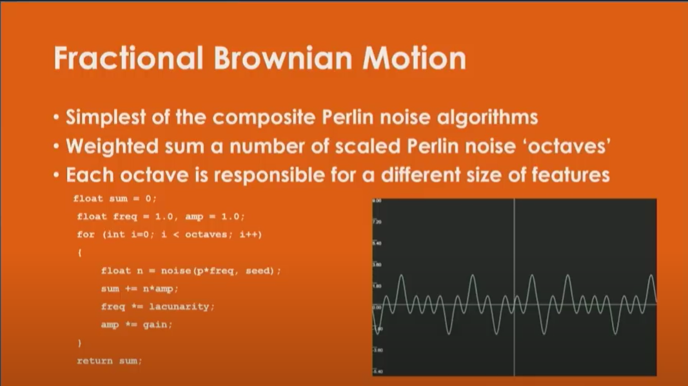
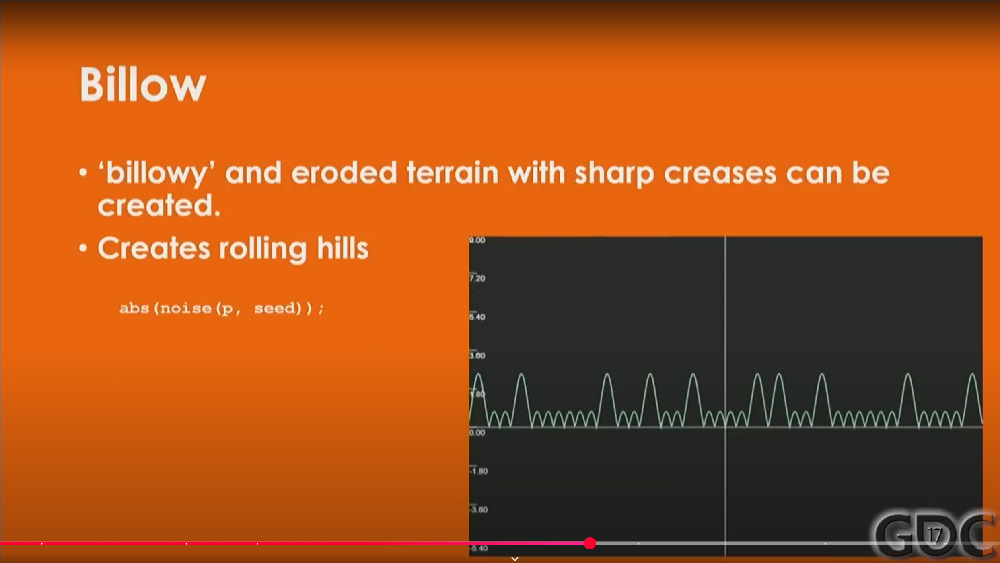
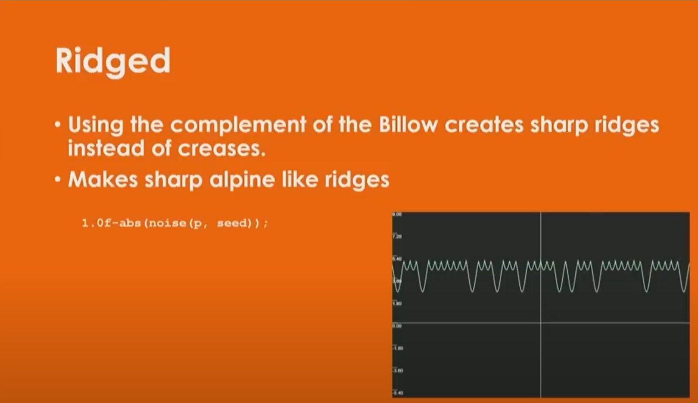

# Building Worlds in No Man's Sky Using Math(s)  

**2017 GDC talk – Apr 17, 2017** 

[](https://www.youtube.com/watch?v=C9RyEiEzMiU)

## Summary  
No Man's Sky is a science fiction game set in a near-infinite procedurally generated universe. In this 2017 GDC talk, Hello Games' Sean Murray details how a tiny team built one of the most-played games of the year using procedural generation techniques grounded in mathematics. He dives into the evolution of their terrain generation, explores the complexity of working at galactic scale, and introduces "Uber Noise"—a unifying method of controlling layered noise for diverse, explorable worlds. Murray also reflects on the development challenges, performance testing across infinite possibilities, and how terrain affects player perception and exploration.

---

## Transcript

### Maths, Not Math

I'm going to be talking about maths. You do your GDC talk, and you put it in, and I had one piece of feedback. That piece of feedback was that I had a typo—that it’s "math." And it's like, it's not "math." There are multiple types of math. It's maths.

### Talk Overview

What I want to talk about is this thing that I worked on: a unified method of noise generation. First, I'm going to talk about some of the problems that we had to solve making No Man’s Sky. I’m going to give you a little bit of history first, because we were a super small team, and we had this problem to solve, which is that we made one of the most played games of last year with just this really tiny team. That brought this whole set of weird problems.

Secondly, I’m going to talk about one of our solutions to that problem—just kind of one specific small part of that—which is a new way of generating noise that I worked on. The reason that I’ve flown in and want to talk about it is because I hope that other people build on it and that it’s useful to people. I would love to see more procedural generation in games.

That’s the third thing I want to talk about: I’ve got thoughts on where procedural generation could go in the future and where we at Hello Games would love to go with it.

### Background

I started out at Criterion, which is now EA—got bought by EA. When I sat down to write a little bit of history about me, I realized I’m really old. I don’t know what happens to old programmers. You don’t generally see them. I presume I’m about to find out. I think they come for you in the night. Something happens. You get disappeared. But I’m near that time now.

I worked at Criterion, which at the time was becoming known for engine and cutting-edge tech. I started out there at 21 as a junior programmer. I left when I was 25. I had done stuff like engine coding, engine lead, tech director—various different places on various different games.

I discovered I’m old because the first quote about RenderWare—when they say “next-generation graphics”—they’re talking about PS2. That’s how old I am. They’re coming for me soon.

Where they talk about Black, a next-generation engine on current-generation hardware—that was an engine I was lead on and worked on a lot. That was PS3—next generation then. I’m one of those old farts that talks about the Spectrum all the time.

I worked on a whole load of math stuff. I didn’t work on RenderWare, but I ended up writing a math library that got used in RenderWare. That was in games you might have played, like GTA, Call of Duty, Battlefield. You’ll know this because I optimized the animation code, and it’s got a bug in it. I saw it in so many games. It was horrible. You would see arms pop inside out. If you saw that, that was me. That’s my mark.

### Engines Dictate Design

The reason I’m explaining this is because I think engines really dictate design decisions. That’s almost your first decision. Your first design decision on any game is what engine you’re using. Loads of things cascade from that.

Before someone lynches me: it’s totally fine if you use Unreal or Unity or whatever. It’s just not something I’ve ever really done. I think they’re great.

Before starting No Man’s Sky, when I sat down to write the first lines of code, the previous seven years—every single one of those years—I had been part of writing a new engine from scratch. I’d done that seven times across seven different games. It begins to get a bit boring. You’re solving the same problems all the time. I wanted to do something a bit new.

No Man’s Sky started as a hobby. It still sort of is for me. I love writing engines. I think it’s a real craft. I would hate to see it die out. I would hate to see us all use Unreal. Almost every new genre—when you think of any new genre—it was created in a new engine. Doom, for example.

The zombie apocalypse is going to come, and who is going to write our engines? Somebody needs to remember how to do that.

We’ve gravitated toward a certain place in games where things are quite iterative. You look at something like Digital Foundry and they zoom in on images, comparing literally pixels between one engine and another in terms of anti-aliasing methods.

I wanted to sit down and write something completely different. Mainly selfishly, because I thought about the things I wanted to learn, and then started to write an engine that had those things in. That was really fun. A really fun period of my life—every evening and weekend, coming home from coding all day and writing my little engine.

Then we showed it. We showed the first trailer. From then on, it was like building a rocket ship on the way up, being fired into the sun, with the skin burning from our faces. It was a bit of a rollercoaster from then on. But at the start, it was just a hobby and something super enjoyable.

### A Unique Experience

It’s something new, and that’s easy to forget when you’re playing it. If you’re playing No Man’s Sky, you’re getting an experience you kind of can’t have anywhere else. I’m excited that this area is being explored now. You’ve got Star Citizen, Elite, Astroneer, and loads of other games doing similar things. But at the time, we were going through it on our own, without a reference point.

It was super technically challenging, and that makes it super interesting. As an engine programmer, that’s fun. There are interesting problems. I had kind of lost that.

Let me take a simple example: working in the engine. You’re never within floating-point accuracy. You’re outside the bounds of what the computer can compute and understand. Y is no longer up. That’s more difficult than you realize. I’ll try to get into that.

Nothing can be pre-baked or pre-calculated. Every solution, even to the smallest problems, is really unique. For example: putting a marker over a building. In any normal game, that’s simple. Get the building’s position and put the marker there.

In No Man’s Sky: you go to get the building. Maybe it’s on the same planet as you. You have to account for curvature. It might be directly underneath you or on the other side of the planet. You have to cast that marker up onto the horizon of where you’re standing.

But Y isn’t up anymore. You have to calculate tangent, bitangent, how close you are to the pole. Maybe the building is on another planet. Maybe it’s behind that planet. Maybe another planet is between you and that one. Both of those planets might be underneath you.

Then, none of the buildings exist right now. They’re expensive to generate. You say, “Find me the nearest building of this type.” You have to start generating terrain and checking if buildings are valid—maybe they’re underwater or on too steep a slope.

When you finally get the position of that building, it’s not in floating-point accuracy. You have to move between different spaces to get it. Then you can place the marker, and the player can fly to it.

I love that. Everything takes way longer than expected. But it’s cool.

---

### Breaking the Routine

Any game developer here must have hit that point where it’s a bit like falling off a log. Every game you make, you’re kind of just doing the same things over and over again. This was new and different and exciting. Now that we’ve done it, it gives us a great kind of power and capability going forward for other things we can do.

If you’re a company that can generate an entire planet at the press of a button, in moments, it’s so freeing in terms of the kind of games you can make and what kind of problems you can explore.

### World Diversity and Size

Let me click through some images—just screenshots people have taken in the game. I want to get across the diversity in the game at the moment. These are all just from people who’ve played or taken screenshots.

What’s interesting about that—which I think—is that No Man’s Sky is really big, but it’s also really small. It was a 2 GB Steam download. Most of that was audio(1.5G). Another 200 MB was pre-baked UI. Everything you saw in those screenshots—because they don’t show UI or audio—that was generated in about 300 MB.

That’s super fun. I find that super cool. By contrast, when we uploaded to Steam, we had to upload our .exe, which is 2 GB, and our goddamn 4 GB banner PSD.

There’s a bunch of unexplored areas that are super cool in terms of procedural generation—like web games or small download experiences. I think that’s super interesting.

It’s small. But it’s also a game that was played quite a lot.

### Hours Played

Let me talk about some of the games that I’ve worked on. Take Joe Danger—there were about four Joe Dangers. Put them all together, and we sold about a million copies. It was played a lot, well-liked, well-reviewed.

But the total number of hours is like this.

Now, this makes me a bit sad: there was a game I worked on, Black, which sold really well—exceptionally well. This is the total number of hours Black was played, compared to Joe Danger. Kind of annoying.

Before that, and just some time in between, some of the team worked on Burnout. Burnout 3 in particular was the most played, highly reviewed, sold incredibly well. That looks like this in terms of hours played.

Roughly similar numbers of copies sold between Black and Burnout. Black was a shorter game.

This is sort of depressing for Joe Danger. But No Man’s Sky dwarfs them in terms of hours played.

In fact, if you look at Steam and things like that, compared to a lot of the big releases of the year—like Deus Ex or Far Cry—No Man’s Sky is, to my surprise, significantly above those. One of the most played games of the year.

The reason I bring that up is not as a boast. I think it’s down to the diversity of the worlds.

It’s really interesting to me—the sheer amount of time people play. We have a kind of scary number of people who have played for 100 hours or more. Far beyond any other game I’ve worked on. Loads of people—I’m not sure how to feel about this—have played for 1,000 hours. The game had been out six months. That’s like five hours a day, every day, or three solid weeks of not eating or sleeping.

### A Small Team

We were a super small team. I harp on about this to give credit to the team that worked on it.

If you average it out, there were only about six people working on the game. That includes production, publishing, marketing, and all that—not that we’re very good with that kind of thing.

So that gives you a bit of an overview of the game’s history and mine.

---

### Noise Generation

I wanted to get into how we created that diversity. I'm going to pick one thing in particular: noise generation.

This is a gross simplification, but basically:
- We generate a bunch of noise—terrain, cloud distribution, fauna, creature populations, and more.
- That noise data fills voxels.
- Voxels are polygonized to turn them into geometry (Meshes).
- Those meshes go to render, physics, and population systems, and everything else.

Earlier today, Innes gave a talk that covered this in more depth—he understands more of it than I do. But I’m going to stay focused on the noise generation side of things.

The core problem I was trying to solve was: 
**How do we create diverse worlds that surprise me as a developer, and also surprise players?**  
Worlds that players can explore for hundreds of hours and still find something new. At the same time, these worlds have to remain playable and predictable—they need to fit within memory budgets, run at acceptable performance levels, and be understandable to the rest of the game systems.

That’s the constraint space I was working in.

---

### Attempt #1: Minecraft-Like Noise

My first attempt—this was like five years ago—I copied Minecraft.

That was quite popular at the time: clone Minecraft. By that I mean using the same method Minecraft uses:
- Low-density Perlin noise
- Trilinear filtering
- Layered noise fields stacked on top of each other.

Notch had discussed this a bit, but I wanted to understand it deeply. I disassembled Minecraft, renamed the variables, reverse-engineered how its terrain system operated. Maybe that was legally questionable, but we didn’t use any of it directly—just studied it, so I think I’m safe.

This was eye-opening: **Minecraft’s noise is underrated.**  
Most people overlook how clever Minecraft’s terrain generation is. In my view, it’s a huge part of why the game is so compelling. When people clone Minecraft, they usually miss this. They recreate the blocky visuals but not the terrain logic, and their worlds feel bland as a result.

It is the core of why Minecraft is so compelling and why it's been such a phenomenon.

Problem is, we were polygonizing those worlds and trying to make something more realistic. The thing that makes Minecraft interesting is all the terraced shapes. That makes it play really well.

When you put something realistic over that, it’s like draping a cloth over it. These are low-density points on a Perlin noise field, trilinear-filtered off. What you get is a load of mounds and pyramids when you put that cloth over the top.

It doesn’t work in a realistic sense. It didn’t play particularly well. You expect to see crevices, erosion, more realistic mountain shapes.

---

### Attempt #2: High-Density Perlin Noise

So I abandoned that and tried something simpler: high-density rather than low-density Perlin noise fields. Straight Perlin noise. This is what *Space Engine* uses if you’re familiar with that.

It’s the classic image of a terrain sim. This is a render from *Terragen.* This is Perlin noise.

I go through people’s CVs and demos when they apply. This is the classic thing you see: unaltered Perlin noise. It sort of looks like mountains—but also sort of doesn’t.

I used to apply loads of image processing to this: pick out features, highlights, add contrast, layer things on top. In some of our earlier videos and demos, we were using some of these methods. But the worlds weren’t that interesting. In earlier trailers for No Man’s Sky, some of those shots came from this stage.

But the more I looked at it, the more I realized it wasn't working.

It turns out the **real world doesn’t actually look like this.**

Perlin noise creates repetitive features. The gradients are too uniform. Slopes are consistent and lack the kind of chaotic variance you see in nature. You don’t get get the abrupt cliffs, the chaotic valleys, or the kind of erosion you’d find in nature.

In short, it resembles terrain, but not real terrain. You get something that looks vaguely mountainous but doesn’t play or feel right. It’s the “default” terrain style in demos, but it lacks depth.

---

### Attempt #3: DEM Data and Real-World Elevation

That brings me to the next thing I tried: DEM data—Digital Elevation Map data.

You can just download it online. It’s real-world data. Captured as contour data. It’s kind of what Google Maps uses.

I thought it would be cool. And somebody else had already done it—Ken Perlin and Eric Parberry, and way better than me.

I downloaded this, extracted the data, parsed it—take Utah, for example—and worked out the rate of change of slopes and shapes. Try to get some of that distribution back into noise generation. Work out the distribution of shape change.

Their conclusion—and mine was the same—is that noise in the real world is exponentially distributed.

You’ll see what I mean.

This is normal Perlin noise. This is Perlin noise trained on DEM data. You get something much more realistic.

If I had my time over, I would love to put more time into this. It’s such a rich area for investigation.

It is, however, unfortunate—the real world is super boring.

We put this into our game. I don’t know if anyone’s ever been for a walk, but it turns out walking in the real world is super boring. I hadn’t been, but I realized that playing the game. You walk for ages, and nothing happens.

I used Utah. I told a friend from Utah. He said, “Utah is so flat sometimes you can see the back of your own head.”

This video from that talk looks awesome. It looks real. This is what you want—but you want it at a different scale. These are the kinds of shapes you want.

But you can see—it’s pretty boring.

---

### Uber Noise

So I went from there to a thing called Uber Noise. I call it Uber Noise.

This was a unifying method of noise generation.

All that experimentation—from over about three or four years—informed what we needed, what we didn’t, what made something fun to play, what gave us control, and what was possible.

And I say over the course of four years—I can’t explain this enough—No Man’s Sky was such a small team. Most of the time, there were only a few programmers. So someone like myself was doing a million different things.

This would be: every once in a while, I’d get a week to work on this. Or I’d work on it in my spare time.

Let me take you through the noise types I used previously and how I brought them together.

---

### Types of Noise

Here are the commonly used noise types:
- Perlin
- Simplex
- Billow
- Ridge
- Worley
- Analytical Derivatives
- Domain Warping

#### Perlin Noise

You’ve seen this everywhere. I don’t mean to sound bad about it—Perlin is amazing. Ken Perlin won an Oscar for it. Everyone still uses it. It’s cool.

What’s going on: you take random noise (like static on a TV) and create gradients from that to form something more cohesive. You get something almost like a sine wave—more cohesive and fractal.

If you take Fractional Brownian Motion (fBm) and stack multiple octaves—each with different amplitudes and frequencies—you get something that looks mountainous. But I’m just showing one octave here.



```C++
float sum = 0;
float freq = 1.0f, amp = 1.0f;
for (int i=0; i < octaves; i++)
{
    float n = noise(p*freq, seed);
	sum += n*amp;
	freq *= lacunarity;
	amp *= gain;
}
return sum;
```

#### Billow Noise



This is that same graph, but with an absolute value function. You ABS everything underneath. You get rounded hills.

```C++
abs(noise(p, seed));
```

When I talk about Uber Noise, sometimes you want it to look like this—(fBm)rolling hills, sharp creases(Billow), and so on.

#### Ridge Noise



Take the complement: `one minus the ABS`. You get sharp ridges. People talk about this and use it a lot.

```C++
1.0f - abs(noise(p, seed));
```

This looks simple—like Bart Simpson’s hair—but in 3D, with enough octaves, it looks super realistic. Like alpine mountains.

This is the kind of noise you see in terrain simulators like *Terragen* or *World Builder.*

---

### Analytical Derivatives and Erosion


```C++
float sum = 0.5f, freq = 1.0f, amp = 1.0f; vec2 dsum = vec2(0.0, 0.0);
for (int i=0; i < octaves; i++)
{
    vec3 n = noiseDeriv(p*freq, seeed);
    dsum += n.yx;
	sum += amp * n.x / (1 + dot(dsum, dsum));
	freq *= lacunarity;
	amp *= gain;
}
return sum;
```

Now this is the good stuff. If you’re doing noise and you’re not using this, you absolutely should.

We want features to change in relation to different octaves of noise. That’s what happens in the real world.

Let me explain something obvious: we have a massive array of voxels—billions. We’re going to generate one voxel at XYZ.

You cannot query surrounding voxels. You can’t ask the voxel next door for info. That cascades—it’s an intractable problem.

So you can’t get erosion easily. You can’t tell if a voxel is high up, low down, at the bottom of a lake, etc.

It seems like this almost unsolvable problem and it's a real problem if you're generating caves, erosion, or Rivers because one feature needs to flow into another and it needs context and you can't get that context but what you can get is the derivative.

The derivative tells you the rate of change of noise at that point. You know if you’re on a slope or flat, trending up or down.

Perlin noise can return an analytical derivative. If you have that, you can make slopes more noisy, or less noisy. Deserts have smooth slopes; alpine terrain is craggy.

That’s what we need.

It’s an awesome trick. Once you have that, you can do so many things.

We also need Uber Noise to return its own derivative, even after it’s calculated Billow or Ridge. So we can feed that into further layers.

---

### Resources and Visualizations

I want to shout out some sites: IQ (Inigo Quilez), who probably everyone knows. [He works on noise](https://iquilezles.org/www/index.html), used to work at Pixar, now at Oculus. He runs a [Patreon](https://www.patreon.com/inigoquilec) —everyone should sponsor.

These sites explain this far better than I do. I’m about to steal some images from them—don’t sue me.

Here’s an example: normal, boring, repetitive Perlin noise. Now, feed in the derivative. You can start smoothing out slopes, have little pockets of detail. It looks more interesting and realistic.

When you’re down in the terrain, playing the game, it’s way more engaging. This is the kind of thing we want.

We’re talking about this as if we’re generating one layer of noise. In No Man’s Sky, we generate many layers—layers upon layers—each feeding into the next.

---

### Domain Warping

Another cool technique: domain warping.

This means distorting the domain of the noise function with another function—often noise feeding into noise in successive octaves.

Here’s a little snippet. This is normal Perlin noise.


**f(p) = fbm( p )**

```C++
float pattern(in vec2 p)
{
    return fbm(p);
}
```

Feed it another function—warp it—you start to get something more realistic.


**f(p) = fbm( p + fbm( p ) )**

```C#
float pattern(in vec2 p)
{
    vec2 q = new Vector2(fbm(p + new Vector2(0.0f, 0.0f)),
	                        fbm(p + new Vector2(5.2f, 1.3f));
    return fbm(p + 4.0f * q);
}
```

It may be subtle, but I’ve looked at this for so long that it’s obvious to me.

Do it again—you see something that looks a bit more like an aerial photo of terrain.


**f(p) = fbm( p + fbm( p + fbm( p )) )**

```C#
float pattern(in vec2 p)
{
    vec2 q = vec2(fbm(p + vec2(0.0f, 0.0f)),
	              fbm(p + vec2(5.2f, 1.3f));
    vec2 r = vec2(fbm(p + 4.0f * q + vec2(1.7f, 9.2f)),
	              fbm(p + 4.0f * q + vec2(8.3f, 2.8f));
    return fbm(p + 4.0f * r);
}
```

Blow it up—you start seeing shapes that look like rivers, flow lines. We use this to create coastlines, rivers.

If you look closely, shapes look like they’re flowing into each other—hence “warping.” You’re warping the image.

IQ has a great image where he colorized this. It looks like a real terrain photo.


**Using q and r to add coloring to the image**

Compare with a real photo—real terrain is super fractal. It’s awesome. Go back and forth between the two—you see similar shapes.

If you imagine water filling this terrain—little rivers form. You can see some of them in the top right. That looks really nice. It starts to not look like a classic terrain sim at all.

---

### Uber Noise Parameters

What we want from our Uber Noise:
- Domain warping
- Erosion on slopes
- Altitude-based erosion
- Ridges
- Plateaus
- Terraces
- Rolling hills
- Non-repeating features
- Analytical derivative returned at the end of it so we can feed that into more layers of uber noise

This is a function for how terrains are generated in No Man’s Sky. This is what we want.
```C++
float UberNoise(
                vec3 lPosition,
				int liOctaves,
				float lfPerturbFeatures,
				float lfSharpness,
				float lfAmplifyFeatures,
				float lfAltitudeErrosions,
				float lfRidgeErosions,
				float lfSlopeErosion,
				float lfLacunarity,
				float lfGain)
```


Each of these is an individual control.

You take more noise over the top and generate floating-point values to vary the warp, sharpness, amplification of features.

That gives very varied features as you walk around.

Out of this experimentation came Uber Noise—a unified method combining:

- Perlin, Billow, and Ridge noise
- Domain warping
- Analytical derivatives
- Altitude and slope-aware erosion
- Multi-octave amplitude modulation

#### Sharpness

Really easy—blend between Ridge and Billow. Instead of binary, you just interpolate.

```C++
float lfRidgeNoise = (1.0f - abs(lfFeatureNoise));
float lfBillowNoise = lfFeatureNoise * lfFeatureNoise;

lfFeatureNoise = lerp(lfFeatureNoise, lfBillowNoise, max(0.0, lfSharpness));

lfFeatureNoise = lerp(lfFeatureNoise, lfRidgeNoise, abs(min(0.0, lfSharpness)));
```

#### Slope Erosion

Control the amount of noise and detail on slopes using the derivative.

```C++
lSlopeErosionDerivativeSum += lDerivative * lfSlopeErosion;

lfSum += lfAmplitude * lfFeatureNoise * (1.0f / (1.0f + dot(lSlopeErosionDerivativeSum, lSlopeErosionDerivativeSum)));
```

#### Altitude Damping

Sometimes you want a basin that flattens out. Maybe something like tectonic or glacial erosion—smooth shapes.

You vary amplitude based on derivative and altitude.

```C++
lfSum += lfDampedAmplitude * lfFeatureNoise * (1.0f / (1.0f + dot(lSlopeErosionDerivativeSum, lSlopeErosionDerivativeSum)));

lfAmplitude *= lerp(lfCurrentGain, lfCurrentGain * smoothstep(0.0f, 1.0f, lfSum), lfAltitudeErrosion);

lfAmplitude = lfAmplitude * (1.0f - ( lfRidgeErosion / (1.0f + dot(lRidgeErosionDerivativeSum, lRidgeErosionDerivativeSum))));
```

#### Domain Perturbation

Warp the domain. That gives you river flows, terrain veins, cliff lines.

```C++
lOctavePosition = (lPosition * lfFrequency) + lPerturbDerivationSum;

lPerturbDerivationSum += lDerivative * lfPerturbFeatures;
```

#### Amplifying Features

Really simple. It drives me crazy I didn’t think of it earlier.

When stacking octaves, emphasize some, dampen others. The lesson from exponential noise distribution: vary octave impact.

Nice trick: don’t let the first octave dominate. That’s what gives repetitive sequences. Instead, have lower octaves with more impact.

That’s an area we could’ve taken further—using DEM data to drive octave weighting.

```C++
float lfCurrentGain = lfGain + lfAmplifyFeatures;
```

---

### Visual Results

Here are some screenshots I took moments ago. Just booted up a planet and flew around.

You see features emerge—sheer cliffs on the side, rounded shapes elsewhere. That’s from amplification of features.

Sometimes it’s round. Sometimes sheer. We’re mixing 2D and 3D noise.

That’s how you get overhangs.

Most planet-generation demos use 2D heightmaps. 2D generation is easier—millions of voxels instead of billions.

But to get caves and overhangs, you need 3D noise. That’s essential for exploration.

Cliff edges, weird shapes—core parts of the game.

Here you see domain warping—snake-like flow. You see variation in noise scale—large hills and small ones, all mixed. 1–2 km-high mountains with caves in them.

#### Caves

I haven’t talked much about caves. Super difficult problem—like erosion.

To generate a cave with an exit, you need to know when to break through terrain. But you can’t query neighboring voxels.

That’s a hard problem.

Here’s a nice image—one layer of Uber Noise. Down at the bottom: domain warping for flow. If you filled it with water, you’d get rivers.

You see steep cliffs, rounded edges, and in the distance, shape variation. Some mountains are sheer; some are rounded.

That’s one reason why people play No Man’s Sky for so long.

We get people saying, “I played for 100 hours, then landed on a planet I hadn’t seen before.” They know it’s different. It gives a real sense of exploration. That’s important.

---

### Untouched Topics and Advanced Features

There’s loads of stuff I haven’t talked about. If I didn’t hate talking to you all, I’d love to talk about it sometime in the future.

Things like:
- Creating SDFs (Signed Distance Fields)
  - Maintaining them—difficult
- Caves
- Features like terraces
- Erosion flowing into rivers

And the really difficult one: noise is unpredictable and non-evenly distributed.

---

### Testing the Untestable

Let’s go through this real quickly. I’m probably running out of time.

I want to talk about how difficult it was to build and test this.

We’re talking about testing the untestable: an infinite number of planets and permutations. You can’t possibly test them all. You’ve got limited memory and performance.

Every player is going to boot up into a different star system with different memory requirements. We can’t know what they’ll hit. We can guess.

We used heuristics—what we did in the end was fly little drones out. Effectively, we had a smoke test that would run and return overall performance after every check-in. It would send back info.

We could do it by numbers, but we can’t test every permutation.

We tried to run as many tests as we could, approximating the kinds of numbers we thought we were going to have.

We were trying to guess how many players we would have.

We looked at what was out there. The two previous games released on Steam, for example.

Inside was an indie game—we’re an indie game. It felt like everyone was playing it when it came out. Awesome game. They beat us at every awards. Deserved it.

They had about 3,000 players concurrently. That’s kind of where I thought we’d be.

But Sony occasionally said to us, “This is kind of a triple-A type product.” So we looked at Far Cry—a huge game. They had about 14,000 max concurrent players.

That made us nervous about our servers. Sheer numbers of people booting up on day one. Were we testing to that level?

---

### Unexpected Scale

We had more players than we expected.

Around 250,000 players when it launched on PC.

The other problem: people were still playing on PS4 when we launched on PC. At PC launch, there were around 500,000 people playing.

That’s difficult when they’re all booting up on planets you haven’t been to.

It’s extremely nerve-wracking when your entire networking team—handling uploads and server connection—is one guy. And it’s only one of his jobs.

We had half a billion discoveries uploaded.

Insane numbers.

But it was super fun. A super interesting thing to do.

---

### Crash Handling and Improvements

At launch, we had about 1% of players on PC having crashes—based on crash dumps.

Most of those were people operating out of min spec. There were some memory-related issues.

It was pretty much on par with games I’ve released before—like Burnout. But we were just operating at a different scale. Far beyond what I’d experienced before in terms of people playing.

By the time Foundation (our update) came out, we had far fewer crashes.

Still about 1%, but we had a million people playing on the day Foundation released. A really small number of crash dumps.

Again, most were just playing outside of min spec.

---

### Rebuilding the Universe

To fix some bugs—but also to embellish the worlds—we rebuilt the universe.

That meant doing it all over again.

We reset all the players. No matter what you were doing—repairing your ship, exploring, in a battle—we had to take your save and place you somewhere safe, even though the entire universe had changed.

That’s a fun thing.

You know people are going to update, and they’re going to go through a million different edge cases.

That’s a very unique problem. Most games don’t update and change every level entirely.

---

### Terrain is Key

It’s something we’re going to keep doing—continuing to work on terrain.

Something people couldn’t put their finger on with Foundation: they kept saying it felt more epic, or had a different feel. That’s the terrain.

I know, because when the changes went in, everyone on the team started saying it too.

You can’t quite put your finger on it, but you know you’re visiting more interesting places—things you haven’t seen before.

That’s something we’re going to keep doing. It’s fun. It’s scary. A very unique problem.

---

### Hello Games

The last thing I want to say: [we’re hiring](https://hellogames.org/join-us/).

Procedural generation will be a small part of games in the future. But for us, it’s a big part of our future.

Many GDC talks—**Horizon**, **Wildlands**—talked about procedural generation components. That’s super cool.

For us, making really unique, weird engine decisions—and letting that dictate a cascade of problems—is our thing.

It’s cool for me to stand up and say to talented people like yourselves: we’re looking for that.

We want to continue making new, impactful tech.

---

### Final Thoughts

We know how hard it is to make games.

I had to break into the industry. That was hard.

I worked on AAA games. That was the hardest thing I’ve done in my life. So stressful. You care creatively. You want to finish it. It’s intense.

Then I started a company. Bonus: you run out of money. You fish under horrible constraints. You make bad decisions sometimes, good ones other times—because of funding pressures.

Then I know what it’s like, with No Man’s Sky, to do something new and weird and experimental—on top of all that.

If you’re interested in working on that kind of thing—great.

Let’s say you want to start your own thing. We’re going to try to help with that too.

We’re starting this thing—super low-key at the moment—called **[Hello Games](https://hellogames.org/).**

We’re going to try to fund and support a couple of projects. We’ve got one already in development.

The focus is procedural generation, experimental games, games research.

More details to follow. But if you’re into this area—we’d love to help people avoid some of the pains we went through.

It’s something I care really passionately about.

---

That’s my talk. If you’re interested, come and email me. I flew in. I now go run and fly out.

I’m not doing questions, but you’ve got the email. I’ll try to be in one of the break rooms later if people have questions.

I’ll let everyone leave and finish up their GDC day. I’m sure you’re sick of people talking.

Thank you.

[Applause]