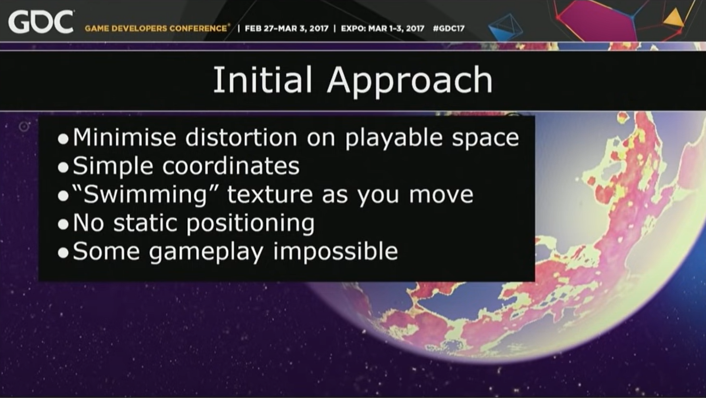
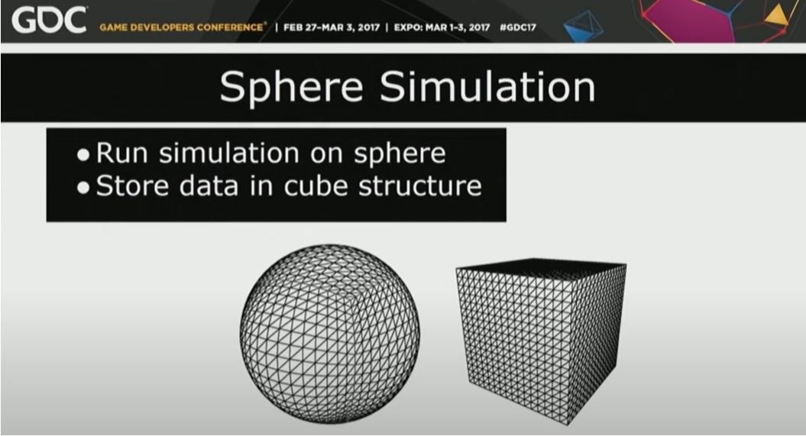
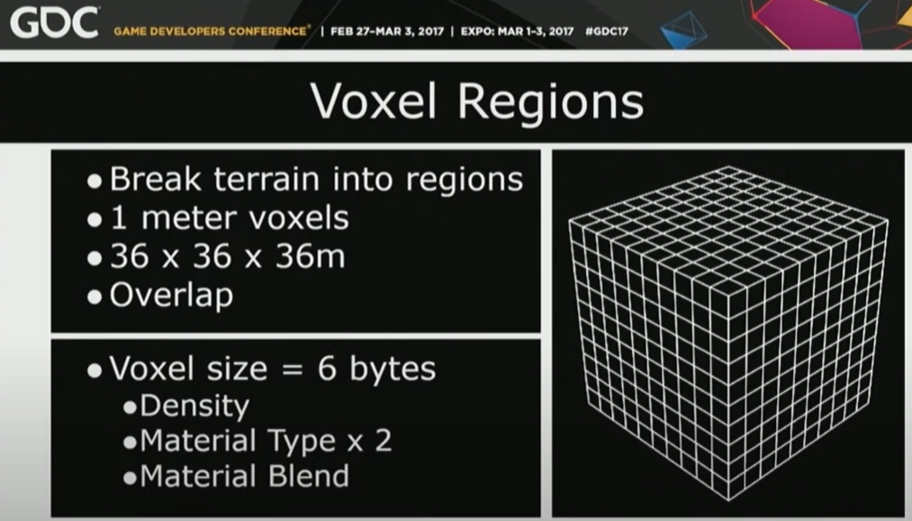
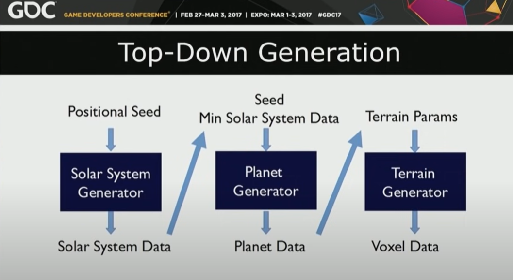
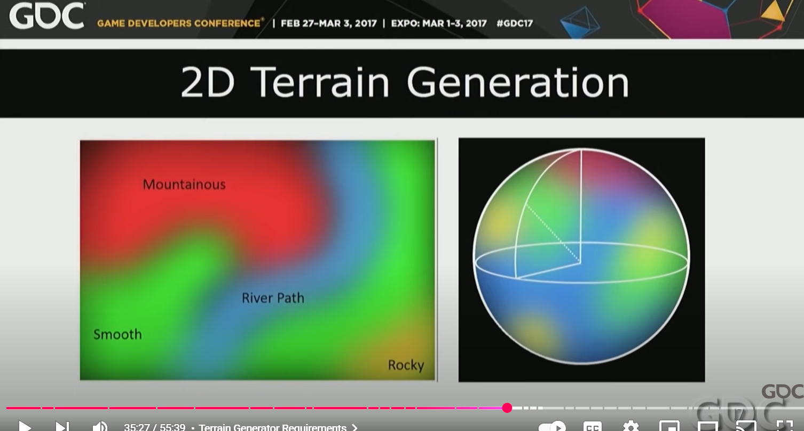
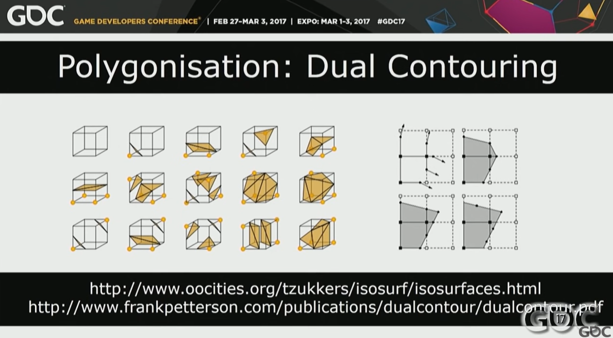
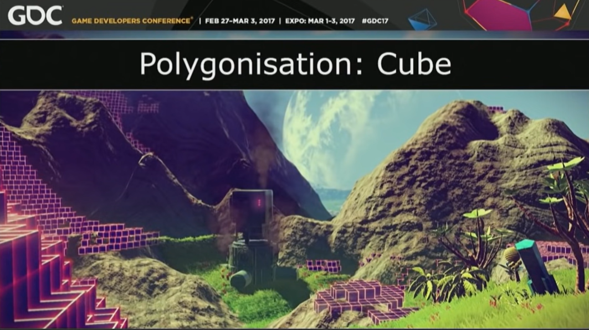

# Continuous World Generation in No Man's Sky

**GDC Talk – Aug 9, 2017**

[](https://www.youtube.com/watch?v=sCRzxEEcO2Y)

## Summary

In this 2017 GDC talk, Hello Games' Innes McKendrick presents a study of the technical architecture of *No Man's Sky*, focusing in particular on the techniques used to generate planets and the supporting structures allowing this to happen continuously in real-time.

---

## Transcript

### Introduction 0:00

[Music] Hey so okay when Mike's working great.  
Good morning everyone, thanks so much for showing up so early and welcome to day one of the main conference. If you've been to the summits over the past couple of days, I hope you enjoyed them, and welcome to those of you just joining us today.  

Before we start, I've got a couple of messages to pass on from the CAS.  
The first thing is that if you can check all your phones or tablets or whatever are set to silent or are turned off.  
The second thing is that about 15 minutes into this session, you'll be emailed a link to an assessment form. If you can really try and give any feedback on that, it is super useful. The speakers get to see it and it's just incredibly appreciated if you could fill that out.  

Okay, so let's get on with the talk. I'm Innes McKendrick and I'm a programmer at a little UK indie game company called **Hello Games**.  
I've been there for about five years now. I joined just before we released ***Joe Danger*** to the movie and then have been working on sci-fi exploration game ***No Man's Sky*** for about four years since then.  
I started on that project really near the beginning when just four of us went and shut ourselves away in a little room in the office right through to shipping, and now we're continuing to work on updates.  

Because we're quite a small company, and just because it suits me as well, I'm a bit of a generalist as a programmer, so I've worked on a number of areas across the project. 
Early on I worked on a bunch of engine related stuff. I've touched a whole load of the prop gen content, things to do with foliage placement, some texturing, and some model composition.
I've also done some work on the visuals for example the atmospherics the water rendering and I've been
involved with a whole bunch of gameplay related programming as well.

This talk is going to kind of reflect that.
It's going to cover quite a lot of content across the board of the game.
This talk is about **continuous world generation** in ***No Man's Sky*** and what I mean by that, the technical architecture of the game is the code that lets us generate and simulate this world in real-time as the game is running.
What it really means is here's our story through a bunch of the really interesting and exciting problems that
we got to solve while working on the game and some of the aspects that make it a bit different to a lot of other
games that are out there in terms of the the technical problems we got to work on.

---

### Project Summary 2:34
 
To give a brief summary of what I'm going to talk through:

- First, I'm going to go over how we structure the world  
  - How geometrically we build our planets on spheres  
  - How we use transforms and work with voxels  
- Then I'm going to talk through our generation pipeline  
  - I'm going to go step-by-step through the process of how we create a world in real time  
  - What's involved in taking an area of terrain and creating it, from being an empty space to something that we can render and play on  
  - The threading, parallelism, and the ordering issues to do with that  
- Finally, I'm going to talk about our simulation itself  
  - The special considerations we have to take because we're working on a game that's generated in real time and occupies a space bigger than we can know a lot of information about

---

### Project Overview 3:24

I think to understand the reason behind a lot of the technical decisions that we made on the project, you have to know a bit of background to it and to the team that I'm working as part of.  

So people probably know ***No Man's Sky*** is a sci-fi exploration game, but for those of you who aren't super familiar with it, it involves the players all starting on planets spread out across a vast galaxy.  
You can take off from those planets and fly continuously and land on another piece of terrain, and the simulation continues throughout that.  

So much of the tech is focused on that core design decision.  
**Hello Games** itself is a small team. As I said, we started off with just four of us working on the project — three programmers and an artist — and we've grown and changed size a little bit.  
We're now at around 20 people for the time being, and that's about 10 programmers — code heavy — and 5 artists.  

On our team that size, everything is hard and everything has to count. Shipping a disk-based game with 20 people was a real challenge — I think it was a real achievement that I'm super proud of.  
But also it means when it comes to the work our artists are doing, the work our coders are doing, we have to be really careful about what we take on.  

Every asset that the artists produce has to count for so much more than the work they're doing. It has to have a real meaning in game.  
Every technical decision that we take on as programmers has to be really pragmatic. We can't really have an R&D team to go off and play with a lot of things for a long time.  
So we had to be really careful about our progress through the project.  

In terms of our philosophy as a company, we're fairly fast and iterative. That's one of the benefits of being a small team, I guess — that we can do that.  
It's a really enjoyable way to work. But it meant we could come across problems, find our way through them, and then see if there were other design approaches and other technical approaches that we could lead off from that.  

We had fairly flexible design goals as well. We'd be really driven by people playing the game rather than by some solid design document laid out for years before the project.  

As I noted, we have to make the most of our artists. But that doesn't just mean making the most of the content they produce.  
It also means generating content in a way that they have real control over.  
That's something that is sometimes missing when people talk about prop gen.  
They talk about replacing artists, and hopefully through this talk you see that that's not our philosophy at all.  
We want to enable our artists to produce more rather than replacing them with an algorithm that doesn't quite do the same job.  

To give a bit more detail on our tech: we work on our own engine, and that's written in C++, which is kind of inconsequential probably, but it's the first question anyone asks so I put it out there.  

If we had to make the decision of what engine to use now, I think that's a way less clear-cut thing.  
You have to remember that we made the choice four years ago to work on our own engine — at a time when there weren't really major voxel-based projects that had a lot of visibility that we could see in Unreal or Unity.  

So taking on an existing engine and having to optimize that and having to work with voxels in that, when we probably wouldn't have source code access and wouldn't have a lot of support, was a really daunting task.  
Whereas our own tech — we know what's going on there. We know we have a lightweight renderer, we know what we can do to it, we know the sort of time that might be involved in expanding and improving that.  

I'm not necessarily saying it's the right route for everyone to go down, but it was the right choice for us at the time for sure.  
We shipped simultaneously on PC and PS4, and we just worked simultaneously on both platforms throughout development, which again, as a small team, is a tricky thing to do.  
Just getting test coverage on those kind of things is an interesting problem.  

As the focus of the talk implies.

---

### Technical Overview 7:20

We use runtime generation, but that has a number of really interesting consequences for the problem, for the game, and for tech problem solving within the game.  

So any generation that we do — because we're producing this vast amount of content — it's more than we can store offline, it's more than we can load into the game.  
So we're generating at runtime, and that gives us performance constraints on all of the generation work that we do that we might not face if we were able to bake out a load of textures, rather than generating them as you warp into a system, or bake a set of terrain rather than generating it in regions as you move around.  

That's really the significant bulk of the work that I'm going to talk about today.  

The other thing that comes from that is that we have to be able to simulate gameplay with only a small knowledge of the world.  
If we're generating this whole planet and that's a bigger space than we can really get much information about at all — we can maybe know a few points of interest, but beyond that, any kind of data we have about it is too much data for us to keep in memory and for us to argue about all the time — so any work that we do has to be able to work just in its own local space without knowledge of whether there's a lake over that mountain, whether you're at the highest mountain on the planet or just a mountain.  
That's a really significant thing to keep in mind, I think, as I'm talking through this.  

A final note is that our engine is really agnostic to procedural content.  
I think people sometimes talk about ***No Man's Sky*** as *the procedural game*, and I'm not sure that's the right way to look at things.  
For us, our engine doesn't really care whether we generate the content online or whether we loaded it, or where it comes from at all to be honest.  
A texture is a texture.  

That's a really significant and useful thing to say, and it's a useful thing to say about the game as well.  
The players shouldn't necessarily know whether your texture was generated or whether an artist created it.  
The sheer size of space that we're working with implies we have to generate content.  
But I guess one of the end goals for a lot of prop gen work at the moment would be that you can generate this massive space, you can create a load of content that would be indistinguishable from something that an artist also directly created.

So, like I said to start with, I'm going to talk about structuring our worlds — working with our spherical planets.  
To understand our simulation process, you kind of have to know how everything is laid out in this way.  
Also, it's just an interesting problem that we worked through.  

It's one of those things where I say we're dealing with planets in space — we want you to be able to take off and land on them — and everyone has an opinion about how we should have done this.  
We had a lot of opinions too.  
We worked through a number of different things, and I think it's probably interesting to talk through the different approaches that did and didn’t work for us.  

Our driving design goal is that ability to fly off the planet, fly to another planet, fly back —  
But it's also that we have distances that have meaning to the player.  
We're simulating a large enough space for some of those to be significant to them.  

So we need to simulate a space where someone walking around the planet — if they want to walk to the other side — that should feel like a really weighty and significant thing for them to do.  
Or if they want to fly around the planet in a ship even, that should take a significant amount of time.  
And again, that changes the way that we work with things.  
We want our players to explore, to feel alone, and that needs those distances to be suitably large. 

---

### Initial Approach 10:50

So like I said, we went through a few iterations, and here’s the first one:  

Our first driving goal — we essentially thought of this problem like you being a sphere, which is an annoying problem.  
If you've had 2 UV spheres, then there are a bunch of issues there with poles and things like that.  
Our first consideration was that we wanted to have a flat plane for the terrain to exist on.  
We wanted to simulate on an XZ plane and again have that flat — have the Y-axis always be up, because that makes things a lot simpler.  
Not just for simulation but also for generating our terrain.  

There are no complications about distortion because you're just generating it in a really continuous XZ space.  
So what we did was we took this plane while you're on the planet and we let you explore it infinitely.  
So if you walk along in the X-direction forever, we’ll just keep making terrain over there, and the same if you walk in the Z.  
But the moment that you leave that planet, we take whatever space and terrain you have and we just wrap it around a sphere.  

And we wrap it around with poles that are placed as far away from the player as possible.  
So that the kind of pinching that you'd expect to see on the poles when you wrap a flat texture to it would at least be as far away as possible.  
We handled that in the shader, so those spheres in space are all actually entirely implicit.  



But of course there are some problems with that.  
So you can kind of see the pinching at the bottom of the screenshot — this must be one of the oldest screenshots that we have of the game.  
It’s pretty early on.  
You can kind of see the pinching at the bottom — some distortion there — and that's not that bad.  
But the thing that makes that really bad is that you're moving around continuously, so you get some swimming coordinates on the sphere.  

And the really significant problem for us was that you end up with some impossible places on your flat terrain that you can't possibly map in a useful way to the sphere.  
So if you have these points of interest — maybe you want to share them with other players, because we have some network aspects that use that — then they can't possibly have the same point,  
because the way your sphere looks depends where you take off from or where you come into it.  

Also, our infinite generation has precision issues.  
You can fix that by wrapping all of your generation functions — we could have interpolation between noise or come up with a new noise function that handles it —  
but that tends to be more expensive than the generation we were already doing.  
Cost was a major factor.  

So I'd consider this a kind of naive approach, but at the same time, it would have been workable.  
I think you could take something like this and probably ship a game using it.  
But it wasn't the right one for us.

---

### Map Transforms 13:31

So the next thing we thought about was, well, a lot of people have been thinking about mapping terrain to spheres and to flat planes for a really long time, so we should look at cartographers and what they're doing.  

So I went through the Wikipedia list of all the good map projections and tried to find the ones with the least distortion.  
Because if you've ever experienced the cartography community, you've probably heard people complain about Mercator projection — which is fair.  
If you come from Greenland, you probably know why that's bad.  

So we tried to look for ones that would be more appropriate.  
But generally there weren't solutions there that were useful to us.  
A lot of the transforms were either expensive or really expensive to invert.  
We need to transform from our flat plane to our sphere and back very often — for loads of vertices or loads of points — so that wasn't really an option.  

And some other techniques that looked promising are really designed for the planet Earth.  
So that image on your left (yep, had to check what was left) I think is a Peirce Quincuncial projection.  
I don't know how that’s pronounced because I've only seen it written down.  
But that really only works if you have oceans in kind of the places that Earth has oceans, and becomes pretty useless when you generalize that to arbitrary planets that we were generating.  

### Sphere Space

So we gave up on this one as well and moved on to the scary approach that we had been trying to avoid.  
In some ways this is the simplest approach, but it's the one with a wide-ranging number of consequences for us.  
That approach is just to run our simulation on the sphere.  

So our coordinates are nice and consistent within our solar system — you can be standing on the planet, you can be standing in space, and you just have this 3D continuous coordinate system.  
That's nice in terms of gameplay.  

But on the other hand, this complicates all of our gameplay coding.  
Because whenever you stand on the sphere, you don't know which way "up" is.  
You have to do that calculation all the time.  

And if anyone is a programmer in the room, you're probably thinking,  
“Oh, so my gravity is always going towards the center of the sphere.”  
Or if you're a graphics programmer, in your shaders you can never simplify anything to be 2D around your world.  
You're always working on this curved plane.  

So it has knock-on effects in just about every area of code that you could think about.  
It makes it more difficult to integrate other people's libraries because they're going to assume that you have an axis that's consistently up.  
I will be really excited to one day work on a project where I always know what up is, and it's the same thing.  

But it is workable though, because it's a simple calculation to do.  
Calculating your up vector from your position on a planet is just considering your position relative to the center.  
So it is cheap and simple.  

But there's a second problem that gets in the way just about all the time when you do things, and that is the Hairy Ball Problem.  
This is a really intuitive theorem — that's if you take a sphere and you imagine it's really hairy and you try to comb it, you can't have continuous hair around that without having singularities — without having little licks.  

So you can't have continuous tangents around your sphere.  
That causes problems with lighting, with normal mapping all the time, and various other places where you don't really think about the fact that you need to use tangents that are in a continuous space.  
But suddenly, when you don't have them, then it's really obvious.  

We can mostly counter that by using projection onto your sphere from three planes — triplanar projection in some places or along a single plane in other places.  
Or we can use local mapping, where maybe our tangents won't be deterministic but they will be continuous.  
We can just calculate them from the first point we reach the planet and then move them continuously from there.  

So it's definitely workable, and it's what we stuck with.  
It's just interesting for new people joining the project.

---

### Sphere Simulation 17:29



The thing about spheres is they're not a really great way for us to store data generally.  
If we have something like voxels or any other data structure, we want to store that in a contiguous, cube-based system.  

So we do store data on a cube.  
We do a projection from our sphere to a cube.  
We simulate everything on that sphere, but when it comes to storing voxel data, we're mapping that onto a cube.  

You can kind of see in the diagram how it just about maps to the face of the cube — you can see where the vertices match up there, hopefully.  
You’d think that would cause a lot of distortion — so if you imagine that we're generating terrain on one of these and then we project to the other,  
then we're having some distortion in the size of the polygons we're generating, or the space the voxels take up.  

But it's generally not a huge problem, because if we generate all our terrain and do most of our work in simulation space,  
and then only map it to a cube when restoring it, then it's just the density of voxels or the space that data is able to take up that's lost.  

So, for example, it means in some areas we'll have a mountain that's composed of a lower density of voxels than another one.  
They’ll maybe be slightly lower poly, but that's probably not noticeable.  
We don't want to have mountains that become half the size or something.  

A question I get sometimes is why we didn't just simulate on a cube.  
But having edge cases at corners — literal edge cases in your world — seems like a nightmare to deal with.  
Having testers come back with problems that only occur in very specific places on your terrain...  
So simulating on the sphere seemed like the right way for us.

---

### Sphere To Cube Transform 19:12

```C++
// Project elevated planet relative position onto the Cube
vec3 SphereToCube(vec3 position)
{
    //Calculate height offset above sphere surface
    //Project pos onto surface of Sphere
    //Calculate elevation as octave noise at pos
    //Calculate normal to the cube face from largest abs component of pos
}
```

That sphere-to-cube transform is really super simple.  
We can do it just by calculating our height offset above the planet, projecting that down onto the sphere just by normalizing that direction and multiplying it by the radius.  
We can calculate which cube face we're on just by taking the absolute value of the largest direction.  

So this is a really simple bit of code to write, and it's really cheap.  
We can do it all the time without having a load of concerns about the fact that we're working in two spaces at once.  

Our result is not on the face of a cube — that’s the other thing to note.  
When I say we're working on the sphere, we're not working directly on the sphere surface.  
We're working on a heightmap or some terrain offset from the sphere.  

So we end up with some space offset from our cube at the other end.  

Going along those lines, that means we're only mapping a limited space offset from the sphere,  
because the further out you get from the surface of the sphere, intuitively, the more distortion you're going to see.  

If you imagine the point to the center of the sphere versus the point to the center of a cube, that's going to be infinitely small in spirals.  
You can make it up of a number of regular voxels in the cube.  
If you progress along that, you can see the distortion gets worse and worse as you go inwards or outwards from your sphere.  

So we can only simulate a limited space, and we choose about 128 meters of height for the sort of voxel data that we store there — which isn't enough.  
I mean, 128 meters gives you some little hillocks, maybe.  
It's not particularly interesting — it doesn't give us the kind of deep oceans that we want or the high mountains.  

So what we do instead is we add this elevation data into our transform.  
Rather than considering the radius of our sphere to be consistent, we choose it to be varying based on noise over the surface of the sphere.  

We have an offset of about 600 meters to a kilometer, which allows us to get really high mountains and deep oceans up to that,  
and then still have our 128 meters of voxel data offset from that.  

That's really cheap, and we can also cache the results for the local area we're in.  
So when we're doing those transforms, it doesn't cause a problem either.

---

### Elevation Transform 21:28

And that's kind of how it fits in with our transforms.
Really all we're doing is calculating a single point of noise every time we call this transform,
and then at the other end we're projecting that down still onto our non-elevated surface of our cube.

---

### Voxel Regions 21:51

Working with voxels — I've mentioned voxels a few times — let's go into some details on how we use them.



We consider our voxels in chunks. We have regions, and for the time being I'm just talking about the nearest LODs, where all of our voxels are one meter cubed.  
We take all these regions and we process them individually, and each one comes out to be a single area of terrain.

Our regions are 32 by 32 by 32 meters in-game.  
But we need some additional voxel data there. We need one row of voxels around the edge that we can polygonize safely,  
because we're creating vertices in between eight of our voxels.  
So we need that extra space to fully cover the area.  

But in addition to that, we want to polygonize a little bit outside each region and have some overlap.  
That gets rid of seams between the terrain due to precision issues.  
So in the end, we end up polygonizing an area that's about 36 by 36 by 36 voxels.  

Their individual voxels are about six bytes:  
  - We have two bytes of density data  
  - Four bytes total for two different materials  

Those materials are made up of — say, our voxels tell you they're made of grass or rock or mountain or sand —  
which we need in texturing and placing things on them later.  
We have two bytes that tell us the extent to which something is rock or grass versus the other materials that it's made up of.  

We retain these in memory right throughout running the game.  
So there's definitely limited quantities that we can store.  
That's just to let us do really quick terrain edits, and we do height tests and other tests against the voxels fairly often.  

So it's useful to keep around, but it would be possible to discard it and load it again.  
Similarly, it would probably be possible to compress it.  
We just haven't done that because it's an expense, and also because compression is a lot less effective than if we have something like Minecraft where your voxels are binary — 1 or 0.  

Because we have varying density data, and we want any compression that we do to be lossless.  
So it's probably something that we'll look at in future as we try and regain more memory from the game to put in new features and fill it with other stuff.  
But for the time being, it's just uncompressed in memory.

Of course, our 36 by 36 by 36 meter regions — we can only have a limited number of those. They're taking up a fair amount of memory.  
So it's pretty obvious that we're going to need to deal with LODs, especially since we're flying off to space and back.

So we want to have a bunch of these that'll be quicker to generate.  
What we do is simply subdivide our regions down. We deal with six LODs, each one being twice the size of the last.  
And again, we still have that overlap at the edges.

Our lower LOD terrain has half the density, so it's going to be lower poly — it's going to be less interesting —  
but we tend to match up at the edges just by polygonizing a little bit over, and we tend not to get holes between LODs.  
It's far enough from the player that you can't notice that you're going from a lower density to a higher one directly in most cases.

The other thing is that we reduce density within those regions.  
So again, just as a memory saving thing, and based on a visual decision of what looks acceptable to us,  
we reduce the density within that.  

So our lower LODs are actually 36 by 36 by 36 voxels — we might halve that or quarter that.  
And we tend to do it in the height a lot more than in the X and Z, just because that looks okay.  
We can get away with reducing the data there.

The other thing is we're splitting these boxes down and these regions down by half, but we only have this 128-meter area to fill.  
So we have four regions — two stacked on top of each other — at 32 meters in the nearest LODs.  
But quickly we start having to do that as we get to lower LODs.

So the point there is that really quickly we end up with lower LODs that are incredibly cheap,  
which means we can have close-to high-density voxel data near us,  
and far away from us, really low poly data that fills in up to the horizon.

---

### Voxel Region Octree 25:49

We store those in an octree.  
We're binary subdividing things — it kind of makes sense in maps.  
It lets us keep up to date with where our regions are as we move around the cube, and it's really quick to find lots of regions when we're within one of them or want to look up one of them.

The thing to note there is that our cube is actually around the surface of a cube.  
So we have our octree — the regions exist around the outside surface.  
So when we're projecting from our sphere to our cube, and we have the data existing outside the edge of the cube,  
that also exists in the octree.

---

### Low Res Planet Sphere 26:34

Those get even lower resolution.  
Those get pretty expensive, and we can't cover one of our large planets with even our lowest LOD voxel data.  

So we also have a much cheaper low-voxel LOD that’s dispersed on it.  
We have a high-level octree that exists — one for the whole solar system — and we just swap it between the planets,  
transfer cancel, creating regions as we need to as we move around.  

But we also create, just as you fly into the system, these low-density voxel spheres.  
They're just two voxels high, so there's really very little data there at all. They're pretty cheap.  

We just generate six separate polygonized cube faces that map onto our sphere,  
and that gives us those planets in a much cheaper way — from any point in the system, all of the time.

---

### The Generation Pipeline 27:19

Okay, so next I'm going to talk through our generation pipeline — how we fill in that voxel data and what we do with it once we've got a whole load of voxels and we need to render it and turn it into a game we can play.

We do some generation at load time.  
Well, there's kind of a hierarchy of where you want to do your generation.  

Ideally, if we could do everything offline, that would be super cheap in the game.  
But we can't. So we do as much as we can at load time, and then we do what we have to as the player is moving around.

So the kind of thing that we can do at load time — sort of rendering some procedural textures, loading any vertex data that we need in order to create models.  
But creating the terrain itself — because there's so much of it — we can't generate a whole planet.  
We have to do that continuously as we're moving around, as the player is playing the game.  
So we just do it in the background along with things like texture streaming.

---

### Pipeline Stages 28:14

Here are the stages that we go through.  
We have our voxel region, and we want to take that through to something that's playable.  

We go through the following stages:

  - First, we generate it. That’s filling in the voxel data from noise until we have our completed density data for that region.  
  - We polygonize it, so we have a vertex mesh.  
  - We then spherify it. We’ve done those two stages just in a voxel cube, and we then spherify that vertex data so that it will fit on our sphere planet.  
  - We then construct a physics mesh.  
  - We construct a nav mesh for creatures.  
  - And then we finish off by covering that region in plants, creatures, buildings — gameplay and things that we need to make it playable.

---

### Threading Overview 28:57

Of course, if we're going to do all this stuff as we're moving around, we have to do it off the main thread.  
We do it using a job system.

Threading in our game is relatively simple.  
We have a main update thread and a main graphics thread, and we have a sync point each frame for those.  
We try to make the terrain interfere with that as little as possible as we're going around.

On PC, all these jobs are handled on the CPU,  
but on PS4 we do some of them in compute shaders.

So to see how our threading works in terms of all the other numbers:

- Points we can do in jobs  
- Points where we have to interfere with the world  

At some point we have to get hold of a vertex data buffer to fill in.  
At some point we have to add our physics to the main physics of the world.  
We have to add all our creatures and position models and things like that.  
But almost everything else we can split off and just run as a job.

What that means is we have all these voxel regions around us, and we need a tactic for ordering those jobs.  
I can kind of show that filling in here.


This GIF is pretty much real-time, run on my laptop before.  
Each one of those little squares is a region that we're creating, and you can see it filling in in real time.  
When it goes again, you'll see each of those regions flipping really quickly through a number of colors,  
and that's them going through their generation, polygonization — all of those stages.

The way that we order those is based really highly on visuals.  
There's no real driving factor aside from what the player experiences and what they see.  
When those regions are going black, that’s them being filled in by a mirror LOD.  
We’re able to fill in this low LOD really quickly, and then we start to bring in more detailed terrain over the top — because that’s the most beneficial to our player.

We generate using a point-based system,  
so the stuff in front of us — we go, “Now, generate this first,” and then the stuff around about us, spreading out from the camera.

Now that we've seen how our regions progress through the steps, I'm going to talk about the steps in a little bit more detail — starting with our terrain generation.

I'm not going to go into loads of detail on all our noise-based techniques,  
but Sean Murray is giving a talk tomorrow at half five that does just focus on terrain generation and the specific math and noise techniques for that.  
So you should go to that one.

It helps here, when we're going to talk about generation, to have a bit of an understanding of how we look at generation in *No Man’s Sky* in general.

---

### Top-Down Generation 31:46

We see generation as this top-down approach always.  
You're always feeding data through one generator, coming up with some more data, feeding that into the next generator, and just doing that continuously until you end up with what you want.



So in the case of terrain, we're starting by knowing which solar system we're in — and we know that by a positional seed.  
We feed that through and generate some info about the solar system: how close the planets are to the sun,  
what kind of sky it has, what the atmosphere is like.  
Then we can feed that data through to each planet along with the planet’s position and basic seed,  
generate some information about whether it should be rocky or cliffy — or have cliffs, you know — or have mountains or oceans.

Then we can feed that through into our terrain generator, which will then come out with the voxel data that we have.

This might seem like a really trivial thing, and it is simple,  
but it is really important because the significant part here is that at any point in between those generators, we have a piece of data.  
We actually have it mostly as XML data that we can write out and store.

When it comes to debugging these processes, that’s hugely useful.  
Anytime that we see a bug or something, we can step into this generator at as many different levels as possible to see what might have gone wrong.  
We can load up future data to check that.  
We can see the same things again, replicate the same problems, and we can store past planets and load them again to check for performance degradation.

---

### Terrain Generator Requirements 33:21

With that in mind, when it came to writing this particular generator —  
the generator that would output our terrain — which is one of a number of generators (along with our texture generator and model generator),  
these are all just independent things that are taking data as input and then putting out something that we can use in the game or in another generator.

We had a number of requirements that we set up for writing that.  
The first is that it has to be:

  - **Direct and consistent** — That comes back to what I was talking about at the very beginning:  
    Our artists or a designer need to have control over the output.  
    They need to be able to work that out from the parameters they're going into it.  
    In the case of the terrain, it's largely Sean — the person who wrote a lot of the generation techniques —  
    who set up the parameters, but he still needs to be able to, separate from being a programmer, fill in those values and get some meaning from what he's writing there.

  - **Real-time** — Of course, we need to generate this as the game is running all the time.  

  - **Varied** — The output space should be large.  
    We want a load of different terrains, and we want them to work.  
    We don’t want holes in them, but we want them to look different to the player.  

  - **Support real-world and abstract shapes** — We want to create both kinds of terrain.  

  - **Adaptable, modular, easy to add to** — That’s key to iteration.  

And then there’s a final point:

  - **Data-local generation** — That’s the kind of interesting and tough point in all of this.  
    If we're generating a single voxel, it can't know anything about any of the other voxels around it.  
    It’s stateless — so it can’t know whether it’s halfway up a mountain or at the top of the mountain, aside from that it *is* a mountain — that it has maybe 50% of a mountain.  

That becomes a real problem when you want to model things like water flowing.  
You have to look at generation techniques that look as though they've evolved over time —  
that look as though they know information about what's next to them.  

We have to model erosion, but you don’t model erosion as the process of eroding.  
You model it as the *end state* of all those things.  
You model something that looks like it has eroded over time.
 
To break that down to how we actually do it, let's start with 2D terrain generation.



Our first stage — as an optimization more than anything else, but also because it simplifies things conceptually — is to block out some shapes in 2D.  
We'll split areas into mountains, into maybe some smoother plains.  
Down there, there's a river.  

This doesn't come out as voxel data — this is just a series of values that are saying the extent to which this voxel is a mountain or is smooth or is a river.  
So it's a much larger amount of data, but we're only retaining it for a short period of time until we go on to 3D generation.

We do this essentially for each voxel column.  
If you imagine we were generating on a flat plane, it would be across the XZ.  
But because we're generating on the sphere, then it's across the surface of our sphere — but without any height.

What comes out of this is like generating a heightmap — without any overhangs or caves.  
We have the height of hills, things like that.

To step through how that looks — we have our terrain.  
There's no noise — it's probably a real boring game.

---

### Elevation Offset 36:34

Then we generate our elevation.  
That generates this noise like I said, in the same way as anything else.  
What you can really see here is that our elevation data is really low in interesting points.  
It’s just some really smooth noise, which is why it’s really cheap.

We store that at this point into a 2D array so that it’s cheap to look up later as well.

---

### 2D Features 36:56

Then we can start to add some 2D features.  
So this is our heightmap that I was talking about — without overhangs or caves — but with some points of interest.  
There’s some rubble in there, there’s some noise.  

This is generating without thinking too much about materials at this point — I’ll talk about that later —  
which is why it's all flat and sandy and brown.  

We’ve got pretty far just talking about our distorted heightmap.  
But we want more interesting terrain.  
We need those 3D shapes — that's what I’ll come onto next.

---

### 3D Terrain Generation 37:22

Our 3D terrain generation works in a really similar way to our 2D.  
We’re layering Perlin or simplex noise or other direct techniques — like some Voronoi noise or cellular noise — but in 3D.  

We’re applying some turbulence on there in positions, and that creates nice pinching shapes and things like that.  

The significant thing is that if you generate a 3D noise field and polygonize it, what you’ll tend to see is blob data in 3D.  
You’ll have big floating islands — there won’t be any meaningful shapes like hills or mountains.  

So we have to fade through that and try and cut off the floating islands.  
We do that just by reducing the density by height as you move away from the surface of the planet.  
That keeps us with nice mountains and hills that can’t possibly have a high density when you go up high.  
If we didn’t have that, we'd have lower density terrain floating arbitrarily.

Like I said, we just write this out into our cube space for the moment,  
but we're generating as though we're on a sphere — so each of those voxel positions, I’m showing it as a cube,  
but then we’re mapping it here — we’re generating as though we’re on the sphere.  
That avoids our distortion.

Here are some 3D shapes that we’ve created — we've got some Perlin worms going on there.  
Those are just some Perlin noise with a threshold on it.  
We can take a slice through that noise and get some cool-looking 3D shapes.

The blue thing that you can maybe see there is some grid noise.  
A nice technique that we do is we consider a grid over the surface of our terrain and we just pick some of those points to put some shapes in.  
We can put in cubes or more distorted and more natural-looking spaces — just spaced out periodically.

That’s really useful for something like terrain resources — we let the player mine resources from it.  
We have real control over how often they show up.  
This was really useful.

---

### Subtraction 39:19

We don’t just do additive techniques — we also do subtractive.  
We can generate caves and things by again taking those Perlin worms but subtracting them from the terrain,  
and considering the mouths of caves to be big open spheres and things like that —  
just to try and build up our toolbox of techniques that we can apply to try and make a diverse range of terrains.

So, after going through those steps, that leaves us with our region that's made up of voxels.  
It's just a load of essentially density data.  

It has some information on materials as well,  
but the density data is the significant thing from which we have to generate our polygon grids.

---

### Polygonisation: Dual Contouring 39:57



We use dual contouring for polygonisation.  
We started out with marching cubes — probably on the left (no, the right — your left, your right) — as a yellow diagram.  
You see the typical marching cubes sort of diagram.

When we polygonise in this way, the significant point is that if you imagine you have your eight voxels, you're creating polygons between them.  
Marching cubes will only create polygons that lie on the edges of those, so it's really bad for creating corners.  
It loses a lot of data to do with shapes when you have really sharp angles.

That's why we moved to using dual contouring.  
There’s some really good information on that — not just on the technique but on other isosurface techniques as well —  
just in the bottom link there, which is where that leftmost diagram is from.

That shows how we retain the corner data.  
We do have to do a little bit more work on that to avoid corners that lie way outside of our cube — we have to consider math points and things —  
but it's basically pretty simple to work through some of the code and it gets us way nicer results.

---

### Polygonisation: Cube 40:59



That’s what gets us, for example, the hills in this image.  

But the thing we do with our voxel data is we don’t just polygonise it once.  
We polygonise it through different polygonisers to get different sets of data.

Looking at the cubes in this image, we also do a cube-based polygoniser to get these nice terrain resource indicators.  
That's more similar to the way in which something like *Minecraft* polygonises.  
It tends to be vertex-heavy, but it's quite cheap.

We're just considering any point, considering the faces around it.  
We consider if there's a fine difference — so if you have a dense region with a non-dense one next door — through mountain with air next to it,  
then we just create a flat plane there, and we can build up that cube data fairly easily.

But like I said, it's quite vertex-intensive, so we only do that in near LODs,  
where we'll generate the actual terrain as far as you can see.

---

### Polygonisation: Flat Plane 41:51

Finally, we have our third super cheap polygoniser, which is just a flat plane polygoniser for the water surface.  

The point to note on this is because we use elevation,  
sometimes we're generating water planes that are way above where our voxel data exists.  
So we're not just generating within those regions — we have to polygonise across the entire planet to see whether we should be putting water there.

I think in future we'll probably move away from polygonising water —  
we’ll probably do it entirely implicitly in a shader.  
But for the time being, we’ve still got that running.

---

### Terrain Materials 42:47

Moving on from that — to how we actually get our terrain looking like interesting terrain that's not all flat, brown, and sandy like the one you saw before.

When we polygonise, we don't just create our vertex positions — we also output normals.  
We choose to retain two normals: a smooth normal and a face normal.  

The only reason to do that is visual — it’s just a visual decision that we’ve made.  
The smooth normal we use for texturing, whereas the face normal we use for lighting.  
That gives us a slightly low-poly look, but lets us get continuous blends across the surface.  

We store that octahedron-encoded so we can stick it in a vec4.  
We also store our two materials.  

Before I was saying that in our voxel data we have two materials.  
When we polygonise, we’re not just considering a single voxel or polygon —  
our vertex comes from the eight voxels around about it, so we’re losing some data there.  

It would be really nice if we could afford to store a whole array of different materials that our voxels could be made up of in the vertex data  
and use that to texture — but it just wouldn’t be performant.  

So instead, we have two materials and the blend value between them.  
The voxel will be whatever it’s made up of most of — so grass and rock, for example.  
We might lose some data — we’d like to blend a mountain texture in there — but generally, it looks okay.

---

### Triplanar Texturing 43:44

Then we can use that to triplanar texture our sphere.

If you haven’t encountered triplanar texturing, that means taking our texture and projecting it along three axes,  
with a blend zone — as is incredibly badly circled on that diagram.

The thing to know about that is we are in fact projecting across the whole sphere.  
We’re not projecting on an axis that’s local to a bit of terrain — it’s across our entire planet.  

You would think that would have really bad artifacts in some areas.  
You’d think that blend zone would be across an entire region of the planet’s surface,  
and we’d have an area where we’re blending between two textures in a really ugly way.  

But actually, we found that wasn’t the case.  
Just because of how our terrain is shaped, we tend to distribute those blend zones across the whole planet fairly easily.  
They tend to come up everywhere but not be overwhelmingly ugly to look at anywhere.

---

### Texture Atlases 44:41

In terms of the texturing, what we’re passing in is basically a height map there.  
I said that our vertex data had those materials and the blend value.  
What that actually means is that we have an atlas of textures that relate to those different materials.  
We choose those and blend between them based on a height texture.

That’s just an artist-created thing.  
We recolor it in the game, but it’s an area where our artists are creating something really carefully —  
really outweighed trying to synthesize these textures.

The other thing to note is that we apply these textures at two different scales.  
We have a lower-detail texture mapped over a much larger scale,  
and a higher-detail texture at smaller scale.  
We continuously replace those as you fly away from or towards the terrain.  

So far from the planet, you’ll see the same texture but at a much larger scale.  
When you zoom in close, then we continuously replace and halve those sizes, and replace them down until we have our two scales of texture still.  

That helps us with our terrain blend as we fly into the planet.

All right — so we have our terrain, we have it textured, it’s in our shader, it’s polygonised, we can render it —  
but it’s not very interesting.  
We have to do stuff to it for it to be useful in the game.

A real important point is that when you're generating your terrain in-game,  
your work isn't just generating that terrain.  
Things that you'd normally bake offline — for example, physics or navigation meshes —  
you also have to calculate as jobs in real time.  

That takes up a way more significant chunk of our time than actually generating or polygonising the terrain.

---

### Foliage Placement: Noise 46:21

The first step in that is placing a bunch of objects.  
That can end up being quite a significant cost.  
It's something that we do in compute shaders on PS4.

The basic approach is really similar to the noise that we're using for generating the terrain.

This is kind of a top-down view.  
Hopefully you can see the kind of green bits are grass, and there are some rocks and plants in there.  
You can kind of picture quite quickly that that might have come from some simplex noise — something like that.  
We're just placing objects with a cutoff at the highest point.

We're also applying an additional layer of noise that just cuts down on the density,  
to quickly give us control over the spacing that we want.

The driving factors here are artistic.  
This is something that Kate Compton talked about before —  
if you ask an artist, then if you have a tree, that's kind of nice.  
If you have a tree with a small rock next to it or a small bush — that's much nicer.  
And if you can work all the way down in scale recursively — continuously —  
the more stuff you add, the nicer it gets.

So: let’s have a tree with some bushes, with some small plants, with some pebbles at the bottom.  
We start to build up our terrain in a nice way.  
This noise-based technique is our way of doing that.

---

### Foliage Placement: Offset Grid 47:33

We additionally use an offset grid.  
That’s just similar to the terrain-based techniques that I was talking about before.  
It lets us place gameplay objects when we really need control over how far apart those are.  
So we just split our terrain into grid cells and choose how many of those should be active.

---

### Foliage Placement – LOD 2 47:33

We also place our terrain objects separately across LODs,  
so we can place much larger objects on our lower LOD terrain.

Here’s not-too-large LOD 1 — we're starting to add in some bushes and things.  
LOD 0 — we have our full set of objects.  
We have our grass that’s only appearing up close, where that LOD comes in.

That presents a problem, because we’re placing our trees, for example, on that lower LOD terrain.  
We’re replacing that whole terrain with something higher detailed as you get closer.  
So we need to reposition them onto the surface.

We do it something like this:  
You can see them fading between impostors and real models, and also readjusting to the surface.  
It’s kind of cheesy that they interpolate like that,  
but it’s far better than popping into position.

Generally, it tends to be much further off from the camera.  
This is me flying really quickly in flight onto an area,  
and it’s just slightly more subtle than sudden popping.

---

### Building Placement 48:55

Building placement — we use really similar techniques.

These are buildings — they're kind of the one thing that we need to see from space.  
We need to know about our points before we get to the planet,  
which means we need a technique where we can easily take any point on the sphere and determine the nearest building.

So we use an offset grid technique.  
If we split our terrain down into regions,  
we can consider each of these points as offset from the center of that,  
and we can quickly recalculate that from any position.

You can generate a diagram of this real easily —  
you can see your nearest building from any point.

Now, quickly, I’ll go through actually simulating on this world that was just generated and covered in plants and physics.

---

### Creature Routines 49:35

The first thing to talk about is our creature routines.  
They are one of the things that depend the most on how our terrain is generated,  
and not knowing where they can go is a significant thing.


As you can see in this GIF, we generate these paths for them to follow,  
but we don't actually add the creatures until you get in really close to them.

So we know ahead of time where there potentially will be a creature,  
where that creature is going to be, and whether the camera is going to reach that point.  
But we don't bring it in until there's actually an intersection.

To go through that again:  
There's a gray path — pink means it needs to become active.  
So we know there’s a creature in that area, and then we get close enough for them to actually come in.  
Which means we can go away and come back and have those creatures remain in their same positions.

We do a really similar thing with all of our objects.  
We fade them in as you fly away and come back.

We use this dither-based technique just in a shader.  
We pass in a zero to one value for all of our terrain and our objects,  
so we can just use that to make sure it comes in appropriately as you're flying around.

Again, we’ve got some GIFs of that.  
Here you can see the terrain generating around you.  
Again, this is me flying really quickly to a point and bringing all of the terrain in.

So it's really noticeable that we're doing this —  
that we're starting with really low-res terrain and bringing in some slightly nicer terrain over the top.

But this is a little bit more subtle as we're flying around.  
You can definitely still notice it, but it's not quite as in-your-face as when I showed you before.

There you can see that blue rock that existed in the nearer LOD — so it faded in there.

This is all time-based.  
We kick that fading off as that region is ready to come in.  
We fade it in, and then we're able to see it.
 
We also do a dithering-based fade for things like grass.  
This is just thinning out grass.  
That's just to cut down on the quantity of grass that we're rendering.

You can see that the grass is slightly different from the terrain underneath it,  
and it thins out as we move away.

I would really like to move a lot more of our fading to be distance-based.  
I think it's much more subtle — you don't notice it so much as you're flying around.  
That’s definitely something we’ll look at in the future.

But it needs you to have generated enough terrain far enough away from you that you can afford to do it based on distance —  
whereas if your terrain comes in quite late, then you really need to fade it in as quickly as possible.

---

### Evaluation 52:03

Finally, I want to talk about evaluation — evaluating our content and our world, and evaluation of procedural content in general.

I’ve spoken about different things in ***No Man’s Sky*** a bunch of times,  
and I kind of like to finish on the importance of this,  
because it’s really meaningful to us.  

It’s meaningful to the artists when they’re generating content,  
that they don’t just see their content in context —  
they don’t just create a model and look at it in the game —  
they see vast quantities of all the assets that come from that model.

That’s true for our planets as well.  
We need to not just create a planet and look at one of them —  
we need to be able to really quickly go through loads of planets and say:  
“Were all my planets red? Is that valid? Did that one time it would be red — but there’s clearly a bug going on that’s caused all of them to look like this?”

Or: “There’s this whole space that we haven’t explored in terms of generation — we could maybe look into that in future.”

That’s a really big one for the artists to go back and forth to, especially —  
but it’s true for us looking at generation techniques for terrain and things as well.

It’s also an important thing for performance —  
that we’re not just looking at one planet, but we’re looking at a vast quantity,  
and that we’re looking at it regularly.

So this is Simon’s smoke test tool, which is really fundamental to us while we’re working on the game.  
We can see performance degradation and things over time.  

Every time we run a build, we see all these screenshots — we get these captures —  
and we know how we’re doing in terms of performance.

It’s important that we’re doing that on the same planet,  
because we’re generating loads of different planets,  
and some of them will be way more performant than others.  
Some will be filled with foliage and life and will be really pushing us.  
Some will be really cheap and not a problem at all.

So we need a way of keeping track of that throughout the project.  
I think if you’re doing any generation stuff at all,  
focusing on these tools is a really significant thing to do.

---

To summarize this talk, I’ve just got a few important takeaways:

I don’t know if all I’ve said today in terms of the specific techniques is useful to you.  
Maybe it’s interesting to you, and I’m happy to talk some more — in more technical detail — to those of you that are interested.  

But I hope the way that we’re making this game is interesting.  
I hope that people will consider it for games in future.  
I hope they’ll think about the fact that we can make interesting spaces in games.  
We don’t have to work on a flat plane — we can work on spheres or on a torus —  
and we can achieve loads of interesting gameplay that we haven’t looked at through that.

We can make deformable voxel worlds.  
We can do that in a large-scale game.  
We can do it on current hardware.

Again — people think about voxels and look at *Minecraft*,  
but there’s so much more that we can do and we can keep doing with that.

We can have procedural-based games where artists remain in control of the content that’s coming out.  
We don’t have to look at procedural generation as a way to replace our artists —  
we can look at it as a way to augment them and to create more content.

And finally — we can create generative worlds,  
and we can create them in real time as the game is running,  
and we can do that today — again, on current hardware.

If we can do that and ship a game as our tiny team,  
there are so many more options for people with more resources out there.  
I think it’s a really valid avenue for us to be pursuing as game developers.  
I think it’s hugely exciting.

All right — so thank you all again for coming today.  
If you want to ask me questions, I’m going to head over to one of the wrap-up rooms,  
but also feel free to shout me online.

And standard plugs for my company — I love it very much.  
You should come work with me. It’s great. Thank You.

---