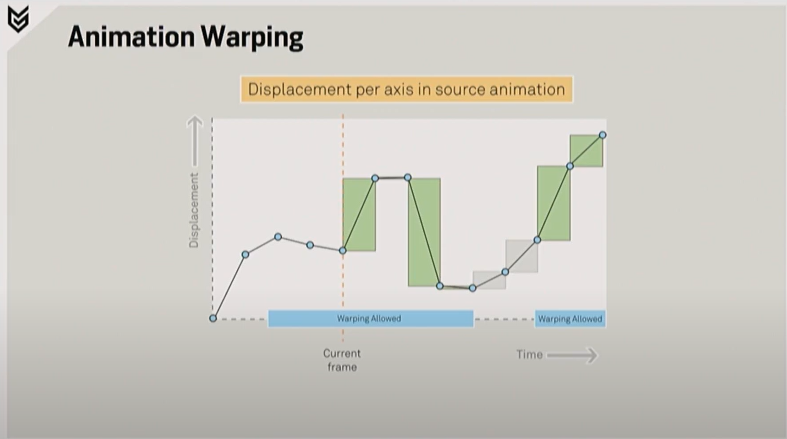
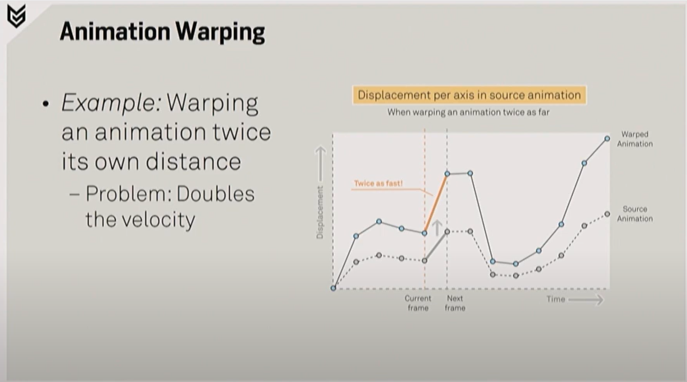
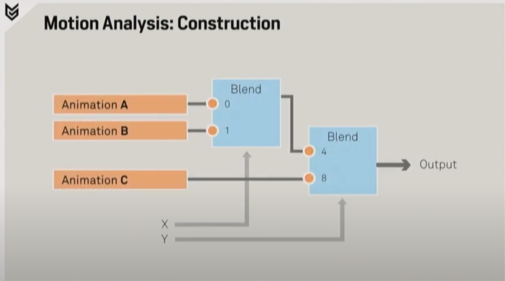
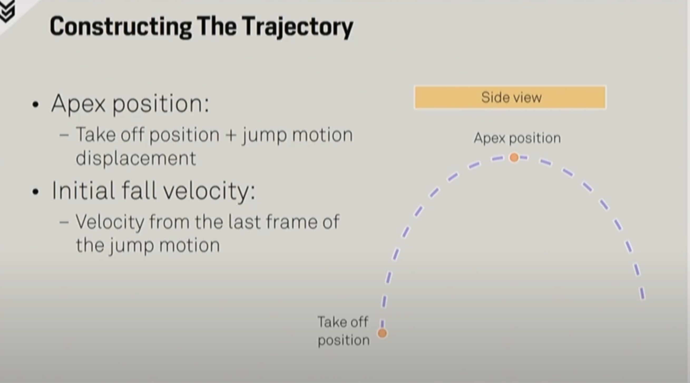

# Player Traversal Mechanics in the Vast World of Horizon Zero Dawn

**GDC Talk – Dec 19, 2018**  

[](https://www.youtube.com/watch?v=LrLHsbTK5bM)
 
## Summary

In this 2017 GDC session, Guerrilla Games' Paul van Grinsven explores the traversal system that allows Aloy to explore the vast world of Horizon Zero Dawn.

---

## Transcript

### Introduction

Hello. Small announcements: could everyone please silence their mobile phones? Thank you all for coming. Really appreciate it.

Welcome to *Player Traversal Mechanics in the Vast World of Horizon Zero Dawn*. My name is Bhavik Hinton and I'm a game programmer at Guerrilla.

I would like to start off with a short video that gives the impression of the various player traversal mechanics in the vast world of *Horizon Zero Dawn*. As the game has just been released this week, you might have already seen some glimpses of it.


So who is this flame-haired female warrior? Let me introduce Aloy: a tribal outcast searching to understand her origins. Aloy is an adventurer with a lot of agility and endurance. Growing up in the wild and years of training made her into a strong climber with well-developed fighting and hunting skills.


The world of *Horizon* is huge and most of most of the terrain is procedurally generated. The world sports a lot of different ecotypes. There's a large variety of rivers, forest, vegetation, climates, and wildlife. Next to that the world is also filled with man-made structures and settlements both indoor as well as outdoor. All of this makes it quite challenging for game programmer to implement a Sulha traversal system.


Now that you've had a small introduction to *Horizon*, let's have a very quick look at what will be covered during this presentation. I will explain very briefly what the goals and constraints were for the traversal mechanics. A short look at our tools workflow and animation pipeline. Then we'll start off with a breakdown on how we achieved creating responsive navigation followed by an in-depth description over more advanced traversal mechanics. Last some of our future plans will be discussed.

---

### Goals And Constraints


To begin with I would like to say a few things about the goals and constraints that we had for Player Traversal at the start of the project.
From the design point of view the overall requirement was to have responsive and fluid movement.
*Horizon* is an open world action RPG responsiveness is a big influence on the actual gameplay.

The traversal development team consists of two programmers, three animators, one designer, and one producer.
From a technical point of view everything needed to run at a minimum of 30 fps. As the terrain is mostly procedurally generated we also had to make sure that all the movement would work properly everywhere in the world, no matter where you are.


***3:00–4:00 Pipeline from Maya/MotionBuilder to Decima***

At guerilla our animators work with both Maya as well as MotionBuilder.
Morpheme is used as an animation middleware(developed by NaturalMotion) consisting of an animation authoring application, Morpheme Connect, and a runtime engine. Morpheme Connect allows our animators to graphically author blend trees, state machines, and transition logic. All this animation behavior for character is stored in an animation network. The Morpheme runtime code that is integrated into our Decima engine then takes care of instantiating such animation networks and handles the runtime playback.

The Decima engine is our own in-house developed engine consisting of an editor and a runtime. The Decima editor is our authoring tool that allows users to graphically build huge and dynamic game worlds, including all systems and logic.


We wanted the world of *Horizon* to have a lot of similarities with our current world, covering a lot of different landscapes.
The image on the slide shows a typical traversable area in *Horizon*. You can see a lot of differences in elevation in the terrain, unlike the Dutch landscape I'm used to, it's not flat at all.

During the presentation I will explain the various mechanics that we have developed that will allow Aloy here, standing on the left of the screen to reach the far right of the screen.
If we want to get anywhere we first have to make sure that Aloy is able to start moving.

---

### Highly Responsive Navigation


In our opinion the field of responsiveness of a controllable third-person character is mostly defined by the starts and stops. That is why for *Horizon* we really want to get a fluid and responsive start/stop system. The system should support left and right footedness. The movement has to be very easy to control where the character should always go into the direction of the players input.


Let me introduce you the first problem we encountered during the early prototyping of our start/stop system. When trying to transition from a stop to a start the movement input wasn't directly handled in the animation network as we were first waiting for the stop animation to be completely finished. This was done because the stop animation contains some nice secondary motion which we would like to show.

Let me visualize what this problem looks like in the next video.


On the top right you can see the input of the controller. Now the latency between the input and the actual movement of Aloy.


The solution to this problem relies heavily on the use of animation events. Within Morpheme each animation clip can be annotated with such events which have a time, the duration, and an ID. The animators can control when, for how long events are active, and how events are blended with multiple animations. Morpheme runtime will provide a list of currently active events to the game after each update. This is an important tool for game logic to synchronize its own state with the animation network.


We solve the problem for the unresponsive stop to start transition by allowing an early reaction during the period of time that the "exit allowed" event is active. When during this event any movement input is given an early transition to the start animation is triggered, to increase responsiveness. If no movement input is given we just continue playing the stop animation until the end before transitioning to the idle.

Normally the exit allowed events are only active at the end part of the animation clip. The next video demonstrates the result.


Let's continue on the start system by taking a close look into the setup of our directional starts. We have three states controlling how to start. We have a forward start state, a left, and a right. The forward state includes all animations for starting to move more or less forward within a 45° angle. Note that we have no support for stepping backwards as in *Horizon* is all about moving forward.

As you might have noticed there are transitions possible between the different start states. This is done to make sure that we can already trigger a new start in a different direction. We found out that this increased responsiveness even further.

Within the start system, we use three animation variables that control the animation Network:  
 - A boolean `move` to indicate if we are willing to move  
 - A float `speed` representing how fast we are willing to move  
 - A float `heading` to indicate the direction in which we would like to move 

Movement in code is handled by movement velocity and a turn speed `x = linear speed (m/s), y = turn speed (deg/s)`.
Turn speed is dependant on movement speed—the faster you move, the faster you can turn.


Aloy has the ability to make a moving 180° turn by quickly steering the movement stick in the opposite direction. Since gamepad sticks and fingers are slow such subtle changes in movement direction still take a few frames, they're definitely not instant. To handle this properly we are keeping a history of the last three movement input directions; we base our stops, turns and, starts on that. Movement speed and direction are always instantly updated.


The image on the slide represents the blend tree of a directional start. As you can see it contains four blend nodes. The first blend node is blending on the move heading: 45°, 90°, and 180°. This make sure we match the current direction of the start direction.
Per direction we can achieve three different speed ranges. We have slow walk, fast walk, and jog. These inputs are blended on the move speed variable.

[Visualization of animation-driven movement phase](HighlyResponsiveNavigationControllingResponsiveness.png)

With the setup of a directional start in mind let's focus on the animation metadata in the animation clips.
This diagram shows the trajectory of a 90° directional start.
All directional start animations are annotated with various events. A very important one is the `locomotion` event. This event tells us at runtime if we should use animation driven movement. During the first part of this animation where the trajectory is rotating we let the Animation completely dictate the movement of our character. This is done to make sure we end in a correct direction as the player requested and it reduces the amount of foot sliding. When the locomotion event is no longer active the character's movement will be completely driven by the regular movement code again.


The use of the locomotion event did cause the problem that our character's movement became unresponsive and uncontrollable during so-called micro movements. Our movement logic was set up as shown in the diagram on the slide. In this example we transition to a stop if the movement stick is released during a start. Because the stop animation contains animation driven forward movement transitioning from a start to a stop would take away all control for the player not giving him any chance to steer or abort. We solved this problem by introducing “steps” and “shuffles” in the start state. We removed the transitions from a start to a stop and from a stop to a start.


Steps and shuffles are start motions combined with stop motions.
 - **Shuffles** are considered directional motions where the foot in there stays the same but quick rotation and small forward displacement is applied in motion.
   - The shuffle is triggered by quickly tapping the movement stick in any direction.
 - We define a **Step** as a small forward motion where the player switches footedness.
   - The step is triggered by letting go of the movement stick once the feet have started to cross each other.
   - It only contains forward displacement and no rotation.

Each directional starting contains an event for when we allow the transition to a step or shuffle.


So let's focus again on the animation metadata in the 90° directional start.
The moment we want to stop moving the current playback position in the animation determines if we will trigger a step or a shuffle. When we have reached the end of the animation clip and we still want to keep moving, we allow an early transition to the cycle.
All transitions from a start animation to either step or shuffle or synchronized transitions. Meaning that the time in the source animation is synced with the destination animation.
Here's a short video that shows what this looks like in action.


Now that we're able to start and stop let's continue with the next obstacle. As seen in the image there's some elevation noticeable in the terrain. Smoothly standing on and walking over such rough and wild surfaces turn out to be quite challenging. 

### Complex Terrain Navigation


Before going into detail now how we achieve smooth movement I would first like to mention the constraints that we had to take into account for the player-character. We don't use a navigation mesh mostly for memory budget reasons we didn't have one making certain things a little bit harder.

Player navigation is done by simulating a capsule shape through the physics world, so no real magic happening here.

We do have:
 - a maximum sloping of 50°
 - a maximum speed of Aloy 6 meters per second while sprinting.
 -  the maximum height that Aloy can jump is 1.5 meters above the ground

Our capsule Collider supports different predefined sizes where the default standing size 1.8 meters high and 70 centimeters wide.


For implementing smooth movement along uneven terrain we need to know what the ground surface gradient is and we definitely like to ignore high-frequency differences in elevation.
Therefore we cannot directly rely on the contact normal of the capsule's intersection with the ground, since that's very sensitive to that.
We solve this by constructing a contact plane from 4 collision probes around the player's capsule Collider and smooth out the results over time.


If you look at the top view image on the slide you can see that we have four probes around the player marked with a blue dot.
All the probes have a fixed start and end offset relative to the player's position and are aligned with the orientation of the player.
The contact plane can then be constructed by calculating a plane normal which is the cross product of the direction between the right and left contact position with the direction between the front and back contact position.
We then smooth out the resulting normal with a previous one to rule even more high-frequency noise. Note that some intersection points of the probes are rejected because of two extreme angles, but as long as we have three or more contact positions we can construct our plane normal.
Once we have constructed our contact plane simply projecting Aloy desired movement onto it will make her move smoothly over the terrain.
The forward and lateral slope angles are also sent by the game logic to the animation network, which allows Aloy to play additive animations based on the slope angle.

To prevent us from having to waste precious cycles while waiting for the probe results, we decided to probe async.
The collision probes are scheduled so they can be executed on different threads later in the frame.
However this means that the results of approach are lacking one frame as we have to wait for the frame to be finished to gather our results.

---

### Foot Placement

So now that the movement is smooth along uneven terrain how do we keep the feet aligned with the ground?
The solution for this is to procedurally adjust the position and orientation of the legs and feet.
`Duration` events in the animations decide when the feet and X are allowed to be adjusted. Our called decides where the feet are allowed to be placed depending on the game state and the results of the collision probe.

Placing a foot and uneven terrain works as follows:
 - We start by doing a ray cast from knee height downwards to the collision mesh to detect any surface underneath the foot
 - The intersection point is sent back to the 2 bone IK over where the chain will be solved from ankle to knee to hips with adjustments of the pelvis as well
 - All animations have been annotated with `footrest` events that control when a foot is resting on the ground.
 We know when adjustmeant has to be fully active.
 Separate events are used per foot.

The described approach works quite well in most situations but one specific case that it can't handle is shown here on the slide, standing close to a cliff with one foot in the air. We've been calling the the floating foot problem. This happens when the downward ray cast is not hitting any ground below the foot. We solve this problem by adding a fall back mechanism in the case that the ray cast is unable to detect the ground.

Once this happened we perform another intersection test but then with a swept sphere instead of a ray so we can actually cover the whole size of the food to find an intersection with the surface. This wider intersection test could find intersections that have a horizontal offset from the food but that's handeled perfectly fine by IK.
However the fall back mechanism is only enabled for a Aloy as NPCs are always attached to navigation mesh that guarantees to have a valid surface underneath.

---

### Vault System

It's not only small differences in elevation that Aloy will encounter when traversing our world. She also has to deal with blocking obstacles like rocks, broken trees, robot parts etc.. As Aloy is very agile we wanted her to effortlessly traverse most obstacles on her way and so our vault system was born.

Our Valt system is capable of performing three types of moves.
We support:
 - Step Up
 - Step Over
 - Step Off
 
The detection distances in parameters that are used are dependent on the current type of movement. For example swimming or sprinting has different detection settings compared to normal walking.

In the vault system the first step is to see if we are actually allowed to vault. Our level designers can disable vaulting in certain gameplay areas by placing trigger volumes. Besides that individual game assets can also be marked as not vaultable for example a table with a pickup on top of it.

If the player is allowed to vault we start by scheduling collision probes. This scheduling is done the same way as how we detect the surface gradients, so again we will be one frame late as the results will only be available in the next frame.

Moving on to the next frame we are now able to process the results from previous frame. The collision probe that we scheduled is a swept sphere intersection test in front of a Aloy. The probe starts at the standing height and ends a few metres below the starting point. If the intersection point of this swept sphere is higher than our current position it means we should start analyzing the obstacle shape for possible step up or step over. If the intersection point has horizontal offset relative to the starting point it means there is no direct ground underneath the starting point and we have probably hit an edge and should start searching for a possible step off.

Because we don't use navigation mesh for the player we have no directly available metrics for the shape of the obstacle, because of this we have to do some smart shape analysis to another set of collision probes. These multiple collision probes are downward ray cast in front of us with a fixed offset in between. This way we can detect the depth of the obstacle and determine if the obstacle is flat enough to actually stand on. By looking at the height differences of the intersection positions of the raycast we can see if we should be stepping onto the obstacle or if we can actually step over it.

For step off the same logic is applied as a step on the only difference is that the intersection position should be lower than a lowest current position.

Once the obstacle shape has been analyzed we store all metrics of the found obstacle which allows us to choose a matching animation to trigger.

Transition selection is based on a scoring system with weighted variables. For each transition we calculate the score and the transition with the highest score will be triggered. First we have to make sure the transition is actually possible for the obstacle matrix. Each transition is categorized by an obstacle type (normal or climbable) and a vault type (step up, step over, step off). Every transition contains metrics of the corresponding vault motion.
Next to that each transition is allowed in defined ranges:
 - maximum upwards displacement
 - maximum forwards displacement etc.

By comparing the obstacle metrics with the animation metrics we can select the transition that suits best.
As we preform climbable vaults over normal vaults each transition to climbable receives a bonus score.

Having looked at finding a valid vault transition let's now move on to executing one. 

---

### Animation Warping

As a result of supporting a variable range for each vault transition we introduced the problem the obstacle has probably never the exact same metrics as the motion in the animation.
How can we make sure that the transition will match the obstacle and actually intersects with the shape?
We use animation warping to solve this problem.
*Animation warping* - is the bending and stretching of an animated motion to reach a specific position at a specific time.
The advantage of warping is that you don't need a lot of unique animations to cover all cases.
Another nice thing is that while warping the destination position can be adjusted during playback.


The image on the slide gives a rough idea of what animation warping does. On the left side you see the original motion and the right shows the warped motion.

In order to efficiently spread out the warping adjustments over time, we need to know the total remaining displacement at any time in the animation. This will require an analysis of the animation. In *Horizon Zero Dawn* all the warping is operating on each axis individually.


Consider this graph to be the displacement over time on the forward axis of the trajectory bone relative to the start position.
Let's say if our current frame is at the orange dotted line, you can see that the next frame will contain a lot of forward displacement, the frame after that will contain almost no four displacement, and frame after that will contain some backwards displacement etc..

By summing up the displacement of the remaining frames we know our total remaining displacement.
To warp this animation for every frame that's played we need to add a little bit of extra displacement and rotation.
The amount of motion that's added each frame is dependent on the amount of displacement in the animation for that frame and the amount that's still remaining.

Calculating the amount of extra displacement that is needed is done by dividing the current displacement by the remaining displacement multiplied by the requested destination displacement.
Note: that the extra displacement is always pointing in the direction of the requested destination.

> [!NOTE]
> Calculate offset of the guided bone to trajectory bone each frame and subtract this offset from the destination.

> [!IMPORTANT]
> Trajectory is defined by motion of guided bone!

#### Warping Enhancments

We improve this basic warping technique with several enhancements that improve the usability and quality of the warped motions a lot.

##### Bone-specific warping

During the warp motions over vaults we needed to make sure that the hands are placed exactly on the obstacle shape.
To achieve this we have extended our warping logic to allow any bone to reach the given destination.
This is done by calculating the offset of the hand bone to the trajectory bone at any point in the animation and subtract its offset from the destination position.
This makes sure the hand bone will end up at the destination position.
One note when using this technique the trajectory is defined by the motion of the hand bone.

##### Warp time windows

Another enhancement that we have implemented is to warp only during specific time ranges.
For example when both feet are still on the ground you probably don't want to enable the warping yet as this will introduce foot sliding.
This is done by using specific animation events that represents the time window when warping can be applied(`WarpingAllowed`).
Multiple events are allowed in one animation clip.



This is a very powerful enhancement to warping and it's very easy to implement.
If the animation event isn't active in the frame we don't take the displacement into account when calculating our remaining displacement.
This is illustrated by the graph on the slide.

##### Custom arrival times

One problem is that sometimes you don't want to reach the destination at the end of the animation but at a specific time in the animation.
We solve this by allowing a user-defined arrival time.
The arrival time is indicated by specific event in the animation (`ArrivalFrame`).
The remaining displacement of the animation used in a warping formula is calculated till the user-defined arrival time.
The displacement after this is not affecting the warping, but can be used for post arrive motions such as a landing animation.

##### Velocity preservation

The last enhancement that we have implemented that can really help improving the quality of the warp motions is to preserve the original velocity of the animation.
One noticeable problem that is caused by warping an animation is that adding displacement can cause unnatural speedups.
We solve this issue by also adjusting the playback speed of the warped animation.



To illustrate this the graph on the slide shows the result of an animation warping to twice its own distance.
You can see in the graph marked with an orange line that this doubles the velocity.


To solve the unnatural speed up we modify the playback speed to cancel out the speed increase.
In this example case we playback at half the speed.
There are limits to how much faster or slower we can can play the animation before it starts looking unnatural as well, therefore we let our animators control
 these on a per animation basis.
 
#### Vaulting

The use of animation warping allowed us to turn the full system into a very versatile system that we use for a lot of different features; such as diving into water, climbing out of water, grabbing ledges.
Here's a short video demonstrating all of these features.


 - We start by triggering a step off.
 - Then there's a step on to a climbable obstacle.
 - Followed by step on to a normal obstacle.

As you can see all vaulting is triggered automatically. I don't press any buttons for triggering the various vaults.

We have various variations:
 - Here we have a step over with the left hand.
 - For that same height we also have one with the right hand.
 - We can dive into water.
 - And climb out of water.

All of this makes Aloy pretty exhausted.

---

### Environment Metadata

Not all obstacles in the world can be vaulted.
Sometimes Aloy's only option to cross it is to jump.
Let's take a look at how Aloy can jump to the ledges at the other side of this river.

I would first like to explain very briefly how we annotate the world with environmental metadata.

The world of *Horizon* is split up in big tiles.
Each tile is 512x512 meters and currently we have more than 100 of them.
Each tile is streamable and 3x3 tiles around Aloy's position are always loaded.

A single tile contains various environmental metadata.
The most common one is probably the **collision mesh**—which in our case is pretty low detailed and is available everywhere in the world.
It tells us where Aloy can and cannot go.
It also provides information about surface materials for impact sounds and effects.

Besides that we have other types of metadata such as:
 - Volumes that indicate where you can swim.
 - Volumes for defining where Aloy can be installed (instilled?).
 - We also have information of all the roads in world:
   - their weight
   - their connections
   - and all of the junctions.
 - But the most important one for the traversal system is:
   - We have annotated geometry that identified traversable routes.

---

### Geometric Annotations

All geometry in the world can be annotated either points or lines.
The points or lines can be attached to static geometry, but also to dynamic moveable geometry.
These points and lines form what we call an annotation
The annotation can contain multiple tags which makes them very abstract and versatile.

In the next slide I will explain why.
As all our geometry is streamable the annotations will happily stream along with it.
As already mentioned they provide semantics for various gameplay systems such as our traversal system.


In this image the red lines highlight the annotations.
We use text to indicate which traversal mechanics are allowed.
Only annotated geometry for example:
 - `Climbable` = Aloy can hang with her hands on the annotation.
 - `Balanceable` = Aloy can't stand with her feet on it.
 - `Unstable` = It should look like that she could fall off at any moment by playing an additive animation.
 - `Ziplineable` = Aloy can zipline along the annotation

Multiple tags are allowed on the single annotation.

---

### Jump System

Before I continue explaining the traversal mechanics that use these annotations I would first like to describe how we did set up our jump system because attaching to one of the annotations often happens from a jump.

In *Horizon* our jump trajectory is split up in two phases.
 - **Pre-apex**: Animation driven
 - **Post-apex**: Code-driven

As already mentioned animation driven movement takes away control, therefore we added **in-air steering**.
During a complete takeoff and falling phase, we allow adjustments only orientation of Aloy which results in bending the trajectory

By applying dampening on the forward momentum when a player lets go of the movement stick we simulate **in-air breaking** and this improves controllability even more.

We are using an animation to even take off to guarantee that the trajectory matches the jump motion.
In our previous games the complete reaction was code driven, which made it hard for our animators to create a matching motion for all the different speed ranges.

With all of these improvements on controllability you could think that jumping towards a specific destination is a piece of cake.
I've prepared a demonstration to see this in action.


As you can see it is still annoying and difficult for the player to time and predict the jump to end at a specific location, at least for an amateur like me.

How can we improve this behavior?

It would really help if we were able to predict the jump trajectory, so we can apply small adjustments to guide the player to a specific traversable destination.
One important note is that we absolutely want to maintain the illusion of control.

---

### Motion Analysis

To be able to predict the jump trajectory at run time we need to know the full motion of our jump animation.
This is why we analyze our animated motion during the offline conversion process and store all the metadata in so-called **motion tables**.

Motion tables are databases of animation metadata for individual animation States.
They contain information about how the displacement speed, time, etc. changes for animation States dependent on the animation variables that affect the animation States.
These motion tables are for example used for storing the animation matrix in the fall transitions as mentioned earlier.

In an offline step we populate our motion tables by analyzing the resulting motion of all animation states for all valid permutation of input variables.
This is quite an expensive task.
At runtime we are able to query the database for a given state with the active runtime animation variables.
Based on the active set of animation variables, several storage results are then blended together to form a final resulting set of metadata.

Here's a rough example of how that works.



This example shows a simple animation state that blends three animations together depending on two input values that are set by the game logic.
In this case variables X and Y.
The blend node simply blends two animations together where the weight depends on the input variable.
In this case when X is zero 100% of A will be blended with zero percent of B.
When X is 0.5 A and B will be equally blended.

For our motion table we want to pre calculate all metrics for animation state.
For certain combinations of input values we are only interested in combinations of input values that make any of the blend nodes choose a single one of its inputs.
In this case we have a total of four input values possible for the two different blend nodes.
X can either be 0 or 1 and Y can either be 4 or 8.
Because there's no blend node attached to the input value when Y equals 8 we have a total of three combinations possible.
So for these three combinations of input values the animation metrics are stored in the table.
Querying metrics for arbitrary input values is now just a matter of blending the storage results together.
Applying the same blending as in the animation network to the value stored in a motion table results in a valid outcome.

```
Metrices for (X=0.25, Y=6)?
 - 0.5*0.75*SampleA +
   0.5*0.25*SampleB +
   0.5*SampleC   
```

---

### Constructing The Trajectory



Now that we're able to query the metrics of a jump motion we can easily calculate the position of our apex by adding a complete displacement from a take-off animation to a take-off position.
This will be the initial position of the falling phase.
The initial velocity will be the velocity of the last frame from the take-off animation, which again is also queried from the motion table.
Using these positions we can construct a **parabolic trajectory** as shown on the slide.

### Jump Guidance: Forward Speed


With the constructed **parabolic trajectory** we can now start searching for nearby jump destinations.
This is done by gathering all possible targets within a certain radius of Aloy.
We iterate over out jump trajectory with a fixed time step to see if a target is reachable at any given moment during the jump.

Targets that are above our apex are never reachable because it would look to unnatural.
If a target is close enough to our originally predicted trajectory we can calculate a skill factor of the parabola by dividing the desired displacement by the original displacement.
This way we know how much extra velocity is needed to reach the target.
We only allow guiding to targets for which the change of velocity is within an adjustable limit, this makes it very easy for designers to tweak and control the snappiness of the jump guidance system.

---

### Jump Guidance: Turn Speed


The previous slide showed how we could predict the trajectory if the target position was exactly in front of Aloy, but since we support **in-air steering** we should also allow some bending of the trajectory to reach a certain destination.

We are able to account for this by calculating the required turn speed by constructing a circle that goes through both our current position as our destination position.
We can do this in 2d since we're only focusing on heading changes.

By calculating the angle between the vector from the current position to the circle center and the target position to the circle center divided by the travel time we have our turn speed.
If the desired turn speed is bigger than an adjustment limit, again we don't allow guidance to this destination.
The next video will show this jump guidance system in full effect.


In this video I will:
 - pause the game
 - press the jump button

Then you can see the original trajectory as a white line and a predicted trajectory with a colored line.
The green circle is a circle used for calculating our turn speeds.
It's a really big green line.

---

### Climbing System

We're almost there now.

The world of *Horizon* is filled with rock walls like this which Aloy can climb without much of a problem.

To give our designers maximum control Aloy can only climb on annotated geometry.
While climbing she's physically attached to the geometry at a single point.


When climbing with hands this **attach point** is between the hands.
This is also the position where a Aloy's trajectory joint is located.
When Aloy is standing on an annotation that **attach point** is located between the feet.

We trigger **transition animations** when climbing from one annotation to another.
First of all we look for all nearby destinations finding the one that has the best combination of distance and angle.
Then we go through all our possible transition animations, currently we have more than 100 of them, and find the one which motions would meet the least amount of **warping**.
Each transition has conditions and ranges that we take into account.
We also check if the transitions motion won't collide with anything.
In the end we will trigger the best transition that we found and warp it to our founded destination.

---

#### Climbing: Guiding Limbs

During climbing we use IK on the hands and feet to guide them.

For the hands we always make sure they are placed onto the geometry.
This can either be on the current position or when we are performing a transition on the destination position.

While climbing we also continually check if our feet can be placed against the geometry in front of us.
If no geometry is available at the foot position the IK on the feet can be turned off and we will let the feet just dangle.

To find the IK rest position we are using multiple collision probes to find an intersection position.
For the hands we use a slightly tilted probe that goes to the palm of the hands.
For the feet we use two sets of collision probes to allow Aloy to pull up her legs a bit more.

Each of the four limbs can be controlled individually.
Our animations control when the hands or feet will be resting on geometry and when not.
We have an animation event that drive our IK and also lock the limbs.

The next video shows the probing and IK in action


Here Aloy is hanging with IK enabled on the hand and feet.
The green lines visualize the intersection tests.

Now Aloy is hanging without the IK enabled on the feet.
The red lines visualized there is no felo geometry for feet to rest against

---

#### Climbing: Dynamic Objects

One of the bigger challenges that we had to support for climbing was **climbing dynamic objects**, such as the tall neck.
For example not all assets in our game have the same update frequency.

Aloy for example is updated at a higher frequency than our tall neck.
So when jumping towards a tall neck or climbing on one we have to compensate the motion of all the tall necks annotations for this difference in update frequency.
Next to that we also have to correctly apply the motion of the object where attached to Aloy's body to make sure our feet and hands are placed correctly on the client asset.
The collision probing also needs to be in sync with the desired update frequency.
Since tall necks are updated at a much lower frequency, their collision volumes also move at a much lower frequency.
So Aloy's probing for collision should also be performed at the same lower frequency to stay in sync.

Well that brings us to the end of the final section.

---

### Post Mortem

Now I would like to emphasize on what we think worked well and what didn't work that well.

#### What Worked Well

First of all what worked really well for us is having the ability to distinguish between early reactions and late reactions when transitioning between animations based on events.
This really allowed us to make the character feel more responsive and helped us a lot in improving the overall quality of our movement system.

The abstract text on the annotations that provides semantics for our traversal system allowed us to create a very reliable jump prediction system as well as a very flexible climbing system.
Because we select client transitions based on required displacement needed to reach a destination, the climbing system managed to even climb moving dynamic geometry.

In the jump guidance system there are only two variables to tweek.
We have a maximum change in velocity and a maximum change in turn speed.
Therefore the designers were able to find their desired balance between snappiness and realism.

A guided trajectory also allows us to already anticipate on the landing.
Making it possible to seamlessly blend to a landing animation that fits the destination, such as tall necks, zip lines, rock walls, etc..

#### What Didn’t Work

What didn't work that well?

Because most of our traversal systems and tools were developed from scratch upon switching from *Killzone* to *Horizon* our level designers initially didn't have the visualization and editor tools to optimize areas for traversability.
Our ambition was to have a lot more traversable parts throughout the world then what we ended up shaping with.

Well the vault system eventually worked out fine it is probably not the best and efficient way to implement it.

A big improvement would be to also support the navigation mesh for the player.
As this would also solve other problems as well, for example:
 - Preventing the player from getting stuck.
 - Entering inaccessible areas.

Last but not least we reach the point where our animation networks have become very complex and hard to maintain.
This is mostly because both programmers as well as animators alter them.
We are looking into making things more manageable by moving more of the decision logic from the network to code as well as applying stricter ownership of the networks.

---

### What’s Next

So what are we thinking of next?

One of the most interesting thoughts last year at the GDC for us was the [talk by Simon Clavet’s a at Ubisoft Montreal about motion matching](http://www.gdcvault.com/play/1022985/Mption-Matching-and-The_Road)
Since there are few similarities with what we've been exploring for *Horizon*, we are very interested in researching some of its possibilities.

As already mentioned in small post-mortem we are probably going to investigate player navigation through the use of a navigation mesh.

We are also very interested in using full body IK for our various mechanics.
We didn't get to it for *Horizon* because of time constraints and regular 2 bone IK was giving fine results, but full body IK sounds like a very useful upgrade.

---

### Acknowledgment

I would really like to thank everyone at Guerilla, team traversal, and especially my colleague - Kaito for helping preparing this presentation.

Tyson I have been working a lot together on these mechanics and therefore will be joining the stage for the Q&A sessions.

---

### Thank You

Finally I would like to end by thanking you all for your attention and interest.
Please fill in the feedback form that should have been sent to your email and if anyone has any questions we will be pleased to answer them.

[Applause]

---

### Questions and Answers

**Q:** How much of the annotation work was done by artists vs. designers?  
**A:** Mostly artists, using Maya. Designers tweak values in our Decima editor.

**Q:** How do players know where they'll land when jumping?  
**A:** It’s intuitive. Guidance only happens within the forward path, so it’s usually clear. We tweak parameters to avoid snapping or unnatural grabs.

**Q:** Why not use a navmesh for Aloy?  
**A:** Memory budget. The player doesn’t have one, but NPCs do.

**Q:** Did you consider auto-generating annotations from geometry?  
**A:** We tried it and it was okay. But designers wanted full control—they didn’t want everything to be climbable.

**Q:** Are left/right hand climb animations random or analyzed?  
**A:** They're random. Each height has left and right handed variants.

**Q:** Could NPCs use the vault system?  
**A:** We tried, but the system is expensive due to probing. NPCs use a navmesh instead.

**Q:** How do you handle narrow ledges when vaulting?  
**A:** The vault ray starts 30cm deep. If it doesn’t hit, vaulting isn’t triggered.

**Q:** How do you prevent unintended vaulting?  
**A:** We mark objects or volumes as unvaultable.

**Q:** What benefits would full-body IK add?  
**A:** Better melee combat height adjustments and steep slope handling.

**Q:** Why not just increase NPC update frequency instead of downgrading Aloy on dynamic objects?  
**A:** Performance cost. It's cheaper to slow down Aloy’s probes briefly.

**Q:** Why use Morpheme middleware?  
**A:** It provides an authoring tool (for blending and states) and a runtime engine (for playing back poses per frame).

**Q:** Do you use physics animations?  
**A:** Yes. We support soft key, hard key, and ragdoll states.

**Q:** Why not use annotations for vaulting too?  
**A:** Vaulting needs to work dynamically on physics debris (e.g., killed robots). We didn’t want artists to annotate all of that.

**Q:** Is the NPC navmesh coarser than what Aloy would need?  
**A:** Yes. NPC navmesh is coarser and more limited. Aloy needs finer traversal on steep slopes.

[Applause]

---
